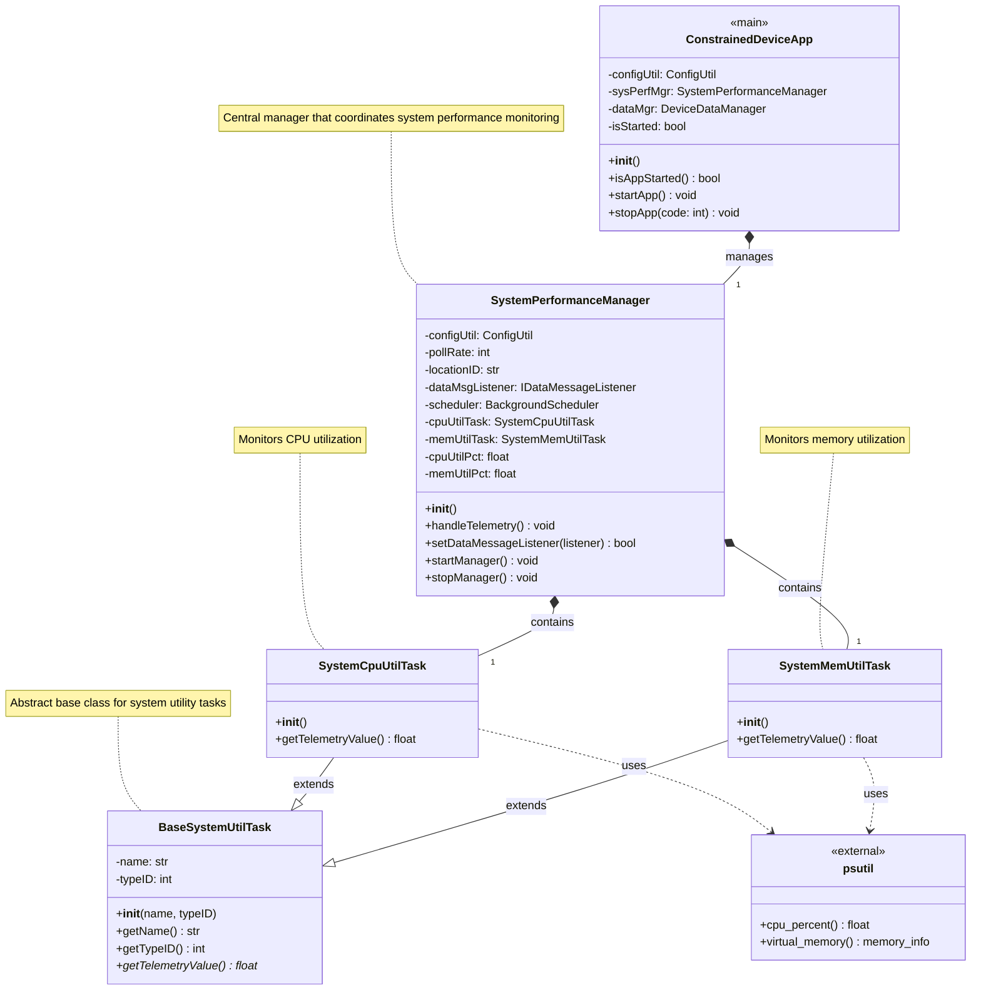

```mermaid
classDiagram
    class ConstrainedDeviceApp {
        <<main>>
        -configUtil: ConfigUtil
        -sysPerfMgr: SystemPerformanceManager
        -dataMgr: DeviceDataManager
        -isStarted: bool
        +__init__()
        +isAppStarted() bool
        +startApp() void
        +stopApp(code: int) void
    }

    class BaseSystemUtilTask {
        -name: str
        -typeID: int
        +__init__(name, typeID)
        +getName() str
        +getTypeID() int
        +getTelemetryValue()* float
    }

    class SystemCpuUtilTask {
        +__init__()
        +getTelemetryValue() float
    }

    class SystemMemUtilTask {
        +__init__()
        +getTelemetryValue() float
    }

    class SystemPerformanceManager {
        -configUtil: ConfigUtil
        -pollRate: int
        -locationID: str
        -dataMsgListener: IDataMessageListener
        -scheduler: BackgroundScheduler
        -cpuUtilTask: SystemCpuUtilTask
        -memUtilTask: SystemMemUtilTask
        -cpuUtilPct: float
        -memUtilPct: float
        +__init__()
        +handleTelemetry() void
        +setDataMessageListener(listener) bool
        +startManager() void
        +stopManager() void
    }

    class psutil {
        <<external>>
        +cpu_percent() float
        +virtual_memory() memory_info
    }

    %% ConstrainedDeviceApp relationships
    ConstrainedDeviceApp *-- "1" SystemPerformanceManager : manages

    %% Inheritance relationships
    SystemCpuUtilTask --|> BaseSystemUtilTask : extends
    SystemMemUtilTask --|> BaseSystemUtilTask : extends

    %% Composition relationships
    SystemPerformanceManager *-- "1" SystemCpuUtilTask : contains
    SystemPerformanceManager *-- "1" SystemMemUtilTask : contains
    
    %% Dependency relationships
    SystemCpuUtilTask ..> psutil : uses
    SystemMemUtilTask ..> psutil : uses
    
    %% Notes
    note for BaseSystemUtilTask "Abstract base class for system utility tasks"
    note for SystemPerformanceManager "Central manager that coordinates system performance monitoring"
    note for SystemCpuUtilTask "Monitors CPU utilization"
    note for SystemMemUtilTask "Monitors memory utilization"
```