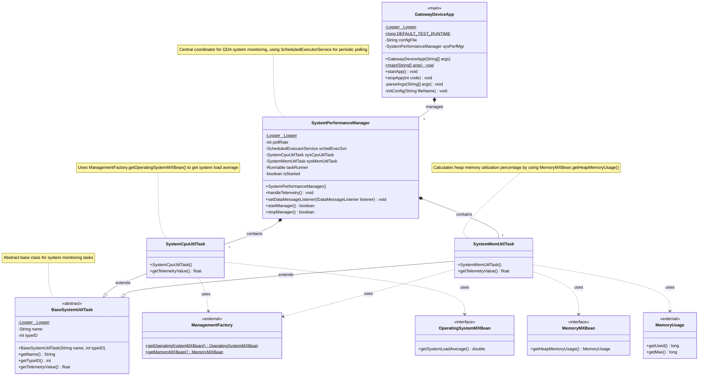

```mermaid
classDiagram
    class GatewayDeviceApp {
        <<main>>
        -Logger _Logger$
        +long DEFAULT_TEST_RUNTIME$
        -String configFile
        -SystemPerformanceManager sysPerfMgr
        +GatewayDeviceApp(String[] args)
        +main(String[] args)$ void
        +startApp() void
        +stopApp(int code) void
        -parseArgs(String[] args) void
        -initConfig(String fileName) void
    }

    class BaseSystemUtilTask {
        <<abstract>>
        -Logger _Logger$
        -String name
        -int typeID
        +BaseSystemUtilTask(String name, int typeID)
        +getName() String
        +getTypeID() int
        +getTelemetryValue()* float
    }

    class SystemCpuUtilTask {
        +SystemCpuUtilTask()
        +getTelemetryValue() float
    }

    class SystemMemUtilTask {
        +SystemMemUtilTask()
        +getTelemetryValue() float
    }

    class SystemPerformanceManager {
        -Logger _Logger$
        -int pollRate
        -ScheduledExecutorService schedExecSvc
        -SystemCpuUtilTask sysCpuUtilTask
        -SystemMemUtilTask sysMemUtilTask
        -Runnable taskRunner
        -boolean isStarted
        +SystemPerformanceManager()
        +handleTelemetry() void
        +setDataMessageListener(IDataMessageListener listener) void
        +startManager() boolean
        +stopManager() boolean
    }

    class ManagementFactory {
        <<external>>
        +getOperatingSystemMXBean()$ OperatingSystemMXBean
        +getMemoryMXBean()$ MemoryMXBean
    }

    class OperatingSystemMXBean {
        <<interface>>
        +getSystemLoadAverage() double
    }

    class MemoryMXBean {
        <<interface>>
        +getHeapMemoryUsage() MemoryUsage
    }

    class MemoryUsage {
        <<external>>
        +getUsed() long
        +getMax() long
    }

    %% GatewayDeviceApp relationships
    GatewayDeviceApp *-- "1" SystemPerformanceManager : manages

    %% Inheritance relationships
    SystemCpuUtilTask --|> BaseSystemUtilTask : extends
    SystemMemUtilTask --|> BaseSystemUtilTask : extends

    %% Composition relationships
    SystemPerformanceManager *-- "1" SystemCpuUtilTask : contains
    SystemPerformanceManager *-- "1" SystemMemUtilTask : contains
    
    %% Dependency relationships
    SystemCpuUtilTask ..> ManagementFactory : uses
    SystemCpuUtilTask ..> OperatingSystemMXBean : uses
    SystemMemUtilTask ..> ManagementFactory : uses
    SystemMemUtilTask ..> MemoryMXBean : uses
    SystemMemUtilTask ..> MemoryUsage : uses
    
    %% Notes
    note for BaseSystemUtilTask "Abstract base class for system monitoring tasks"
    note for SystemPerformanceManager "Central coordinator for GDA system monitoring, using ScheduledExecutorService for periodic polling"
    note for SystemCpuUtilTask "Uses ManagementFactory.getOperatingSystemMXBean() to get system load average"
    note for SystemMemUtilTask "Calculates heap memory utilization percentage by using MemoryMXBean.getHeapMemoryUsage()"
```