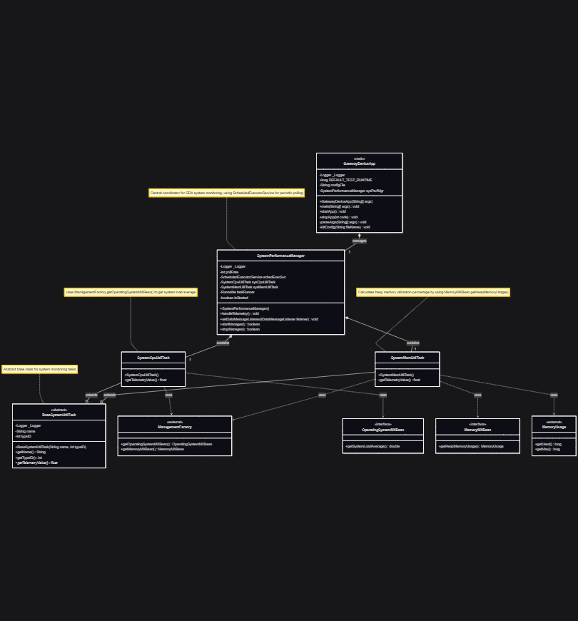

# Gateway Device Application (Connected Devices)

## Lab Module 02

Be sure to implement all the PIOT-GDA-* issues (requirements) listed at [PIOT-INF-02-001 - Lab Module 02](https://github.com/orgs/programming-the-iot/projects/1#column-9974938).

### Description

NOTE: Include two full paragraphs describing your implementation approach by answering the questions listed below.

What does your implementation do? 

A: Add system performance monitoring to CDA and GDA

How does your implementation work?

A: Complete `BaseSystemUtilTask` module, and base on it implement `SystemCpuUtilTask`, `SystemMemUtilTask` and finally link them to `SystemPerformanceManager`

### Code Repository and Branch

URL: https://github.com/BenderPL0120/TELE6530_GatewayDevice/tree/labmodule02

### UML Design Diagram(s)

### Unit Tests Executed

- SystemCpuUtilTaskTest
- SystemMemUtilTaskTest
- 

### Integration Tests Executed

- SystemPerformanceManagerTest
- GatewayDeviceAppTest
- 

EOF.
