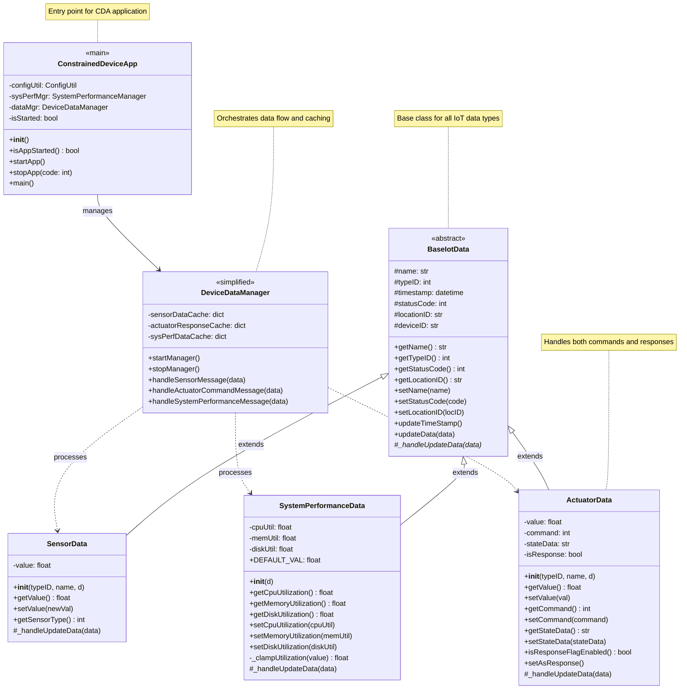

```mermaid
%% Part 1: Data Model Architecture
classDiagram
    class BaseIotData {
        <<abstract>>
        #name: str
        #typeID: int
        #timestamp: datetime
        #statusCode: int
        #locationID: str
        #deviceID: str
        +getName() str
        +getTypeID() int
        +getStatusCode() int
        +getLocationID() str
        +setName(name)
        +setStatusCode(code)
        +setLocationID(locID)
        +updateTimeStamp()
        +updateData(data)
        #_handleUpdateData(data)*
    }

    class SensorData {
        -value: float
        +__init__(typeID, name, d)
        +getValue() float
        +setValue(newVal)
        +getSensorType() int
        #_handleUpdateData(data)
    }

    class ActuatorData {
        -value: float
        -command: int
        -stateData: str
        -isResponse: bool
        +__init__(typeID, name, d)
        +getValue() float
        +setValue(val)
        +getCommand() int
        +setCommand(command)
        +getStateData() str
        +setStateData(stateData)
        +isResponseFlagEnabled() bool
        +setAsResponse()
        #_handleUpdateData(data)
    }

    class SystemPerformanceData {
        -cpuUtil: float
        -memUtil: float
        -diskUtil: float
        +DEFAULT_VAL: float
        +__init__(d)
        +getCpuUtilization() float
        +getMemoryUtilization() float
        +getDiskUtilization() float
        +setCpuUtilization(cpuUtil)
        +setMemoryUtilization(memUtil)
        +setDiskUtilization(diskUtil)
        -_clampUtilization(value) float
        #_handleUpdateData(data)
    }

    class ConstrainedDeviceApp {
        <<main>>
        -configUtil: ConfigUtil
        -sysPerfMgr: SystemPerformanceManager
        -dataMgr: DeviceDataManager
        -isStarted: bool
        +__init__()
        +isAppStarted() bool
        +startApp()
        +stopApp(code: int)
        +main()
    }

    class DeviceDataManager {
        <<simplified>>
        -sensorDataCache: dict
        -actuatorResponseCache: dict
        -sysPerfDataCache: dict
        +startManager()
        +stopManager()
        +handleSensorMessage(data)
        +handleActuatorCommandMessage(data)
        +handleSystemPerformanceMessage(data)
    }

    BaseIotData <|-- SensorData : extends
    BaseIotData <|-- ActuatorData : extends
    BaseIotData <|-- SystemPerformanceData : extends

    ConstrainedDeviceApp --> DeviceDataManager : manages
    DeviceDataManager ..> SensorData : processes
    DeviceDataManager ..> ActuatorData : processes
    DeviceDataManager ..> SystemPerformanceData : processes

    note for BaseIotData "Base class for all IoT data types"
    note for ActuatorData "Handles both commands and responses"
    note for ConstrainedDeviceApp "Entry point for CDA application"
    note for DeviceDataManager "Orchestrates data flow and caching"
```
