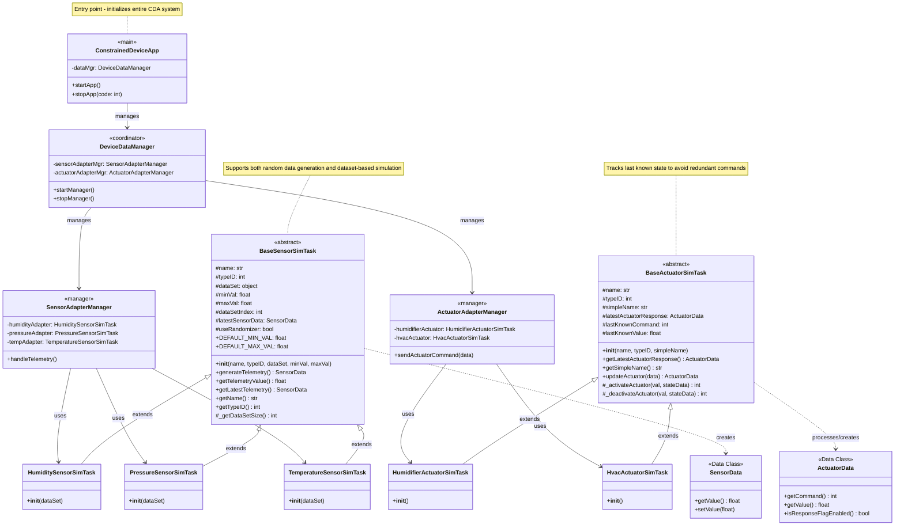

```mermaid
%% Part 2: Simulation Tasks Layer
classDiagram
    class ConstrainedDeviceApp {
        <<main>>
        -dataMgr: DeviceDataManager
        +startApp()
        +stopApp(code: int)
    }

    class DeviceDataManager {
        <<coordinator>>
        -sensorAdapterMgr: SensorAdapterManager
        -actuatorAdapterMgr: ActuatorAdapterManager
        +startManager()
        +stopManager()
    }

    class SensorAdapterManager {
        <<manager>>
        -humidityAdapter: HumiditySensorSimTask
        -pressureAdapter: PressureSensorSimTask
        -tempAdapter: TemperatureSensorSimTask
        +handleTelemetry()
    }

    class ActuatorAdapterManager {
        <<manager>>
        -humidifierActuator: HumidifierActuatorSimTask
        -hvacActuator: HvacActuatorSimTask
        +sendActuatorCommand(data)
    }

    class BaseSensorSimTask {
        <<abstract>>
        #name: str
        #typeID: int
        #dataSet: object
        #minVal: float
        #maxVal: float
        #dataSetIndex: int
        #latestSensorData: SensorData
        #useRandomizer: bool
        +DEFAULT_MIN_VAL: float
        +DEFAULT_MAX_VAL: float
        +__init__(name, typeID, dataSet, minVal, maxVal)
        +generateTelemetry() SensorData
        +getTelemetryValue() float
        +getLatestTelemetry() SensorData
        +getName() str
        +getTypeID() int
        #_getDataSetSize() int
    }

    class HumiditySensorSimTask {
        +__init__(dataSet)
    }

    class PressureSensorSimTask {
        +__init__(dataSet)
    }

    class TemperatureSensorSimTask {
        +__init__(dataSet)
    }

    class BaseActuatorSimTask {
        <<abstract>>
        #name: str
        #typeID: int
        #simpleName: str
        #latestActuatorResponse: ActuatorData
        #lastKnownCommand: int
        #lastKnownValue: float
        +__init__(name, typeID, simpleName)
        +getLatestActuatorResponse() ActuatorData
        +getSimpleName() str
        +updateActuator(data) ActuatorData
        #_activateActuator(val, stateData) int
        #_deactivateActuator(val, stateData) int
    }

    class HumidifierActuatorSimTask {
        +__init__()
    }

    class HvacActuatorSimTask {
        +__init__()
    }

    class SensorData {
        <<Data Class>>
        +getValue() float
        +setValue(float)
    }

    class ActuatorData {
        <<Data Class>>
        +getCommand() int
        +getValue() float
        +isResponseFlagEnabled() bool
    }

    ConstrainedDeviceApp --> DeviceDataManager : manages
    DeviceDataManager --> SensorAdapterManager : manages
    DeviceDataManager --> ActuatorAdapterManager : manages
    
    SensorAdapterManager --> HumiditySensorSimTask : uses
    SensorAdapterManager --> PressureSensorSimTask : uses
    SensorAdapterManager --> TemperatureSensorSimTask : uses
    
    ActuatorAdapterManager --> HumidifierActuatorSimTask : uses
    ActuatorAdapterManager --> HvacActuatorSimTask : uses

    BaseSensorSimTask <|-- HumiditySensorSimTask : extends
    BaseSensorSimTask <|-- PressureSensorSimTask : extends
    BaseSensorSimTask <|-- TemperatureSensorSimTask : extends
    
    BaseActuatorSimTask <|-- HumidifierActuatorSimTask : extends
    BaseActuatorSimTask <|-- HvacActuatorSimTask : extends
    
    BaseSensorSimTask ..> SensorData : creates
    BaseActuatorSimTask ..> ActuatorData : processes/creates

    note for BaseSensorSimTask "Supports both random data generation and dataset-based simulation"
    note for BaseActuatorSimTask "Tracks last known state to avoid redundant commands"
    note for ConstrainedDeviceApp "Entry point - initializes entire CDA system"
```
