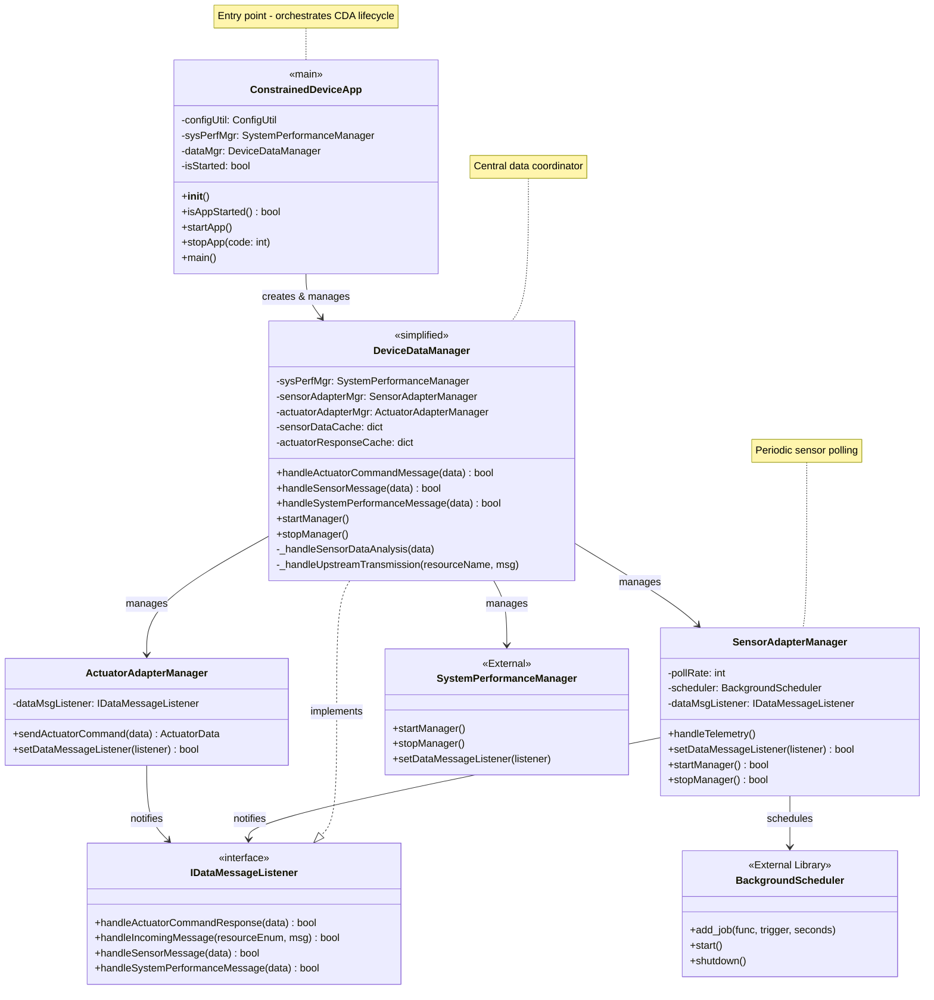

```mermaid
%% Part 3: Management and Control Layer
classDiagram
    class ConstrainedDeviceApp {
        <<main>>
        -configUtil: ConfigUtil
        -sysPerfMgr: SystemPerformanceManager
        -dataMgr: DeviceDataManager
        -isStarted: bool
        +__init__()
        +isAppStarted() bool
        +startApp()
        +stopApp(code: int)
        +main()
    }

    class DeviceDataManager {
        <<simplified>>
        -sysPerfMgr: SystemPerformanceManager
        -sensorAdapterMgr: SensorAdapterManager
        -actuatorAdapterMgr: ActuatorAdapterManager
        -sensorDataCache: dict
        -actuatorResponseCache: dict
        +handleActuatorCommandMessage(data) bool
        +handleSensorMessage(data) bool
        +handleSystemPerformanceMessage(data) bool
        +startManager()
        +stopManager()
        -_handleSensorDataAnalysis(data)
        -_handleUpstreamTransmission(resourceName, msg)
    }

    class SensorAdapterManager {
        -pollRate: int
        -scheduler: BackgroundScheduler
        -dataMsgListener: IDataMessageListener
        +handleTelemetry()
        +setDataMessageListener(listener) bool
        +startManager() bool
        +stopManager() bool
    }

    class ActuatorAdapterManager {
        -dataMsgListener: IDataMessageListener
        +sendActuatorCommand(data) ActuatorData
        +setDataMessageListener(listener) bool
    }

    class IDataMessageListener {
        <<interface>>
        +handleActuatorCommandResponse(data) bool
        +handleIncomingMessage(resourceEnum, msg) bool
        +handleSensorMessage(data) bool
        +handleSystemPerformanceMessage(data) bool
    }

    class SystemPerformanceManager {
        <<External>>
        +startManager()
        +stopManager()
        +setDataMessageListener(listener)
    }

    class BackgroundScheduler {
        <<External Library>>
        +add_job(func, trigger, seconds)
        +start()
        +shutdown()
    }

    ConstrainedDeviceApp --> DeviceDataManager : creates & manages
    DeviceDataManager ..|> IDataMessageListener : implements
    DeviceDataManager --> SensorAdapterManager : manages
    DeviceDataManager --> ActuatorAdapterManager : manages
    DeviceDataManager --> SystemPerformanceManager : manages
    
    SensorAdapterManager --> IDataMessageListener : notifies
    SensorAdapterManager --> BackgroundScheduler : schedules
    
    ActuatorAdapterManager --> IDataMessageListener : notifies

    note for ConstrainedDeviceApp "Entry point - orchestrates CDA lifecycle"
    note for DeviceDataManager "Central data coordinator"
    note for SensorAdapterManager "Periodic sensor polling"
```
