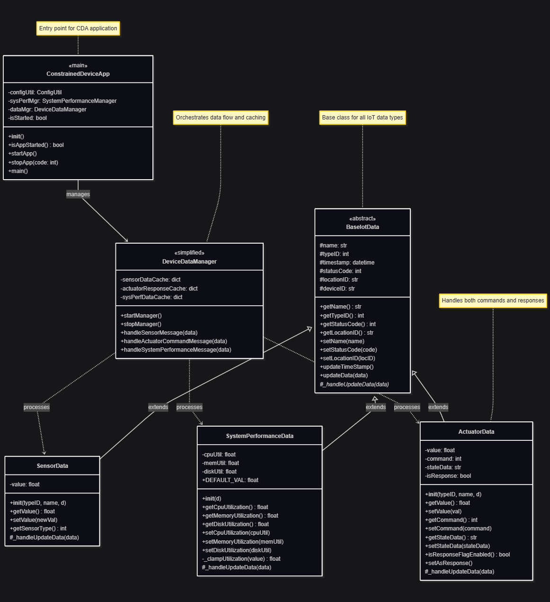
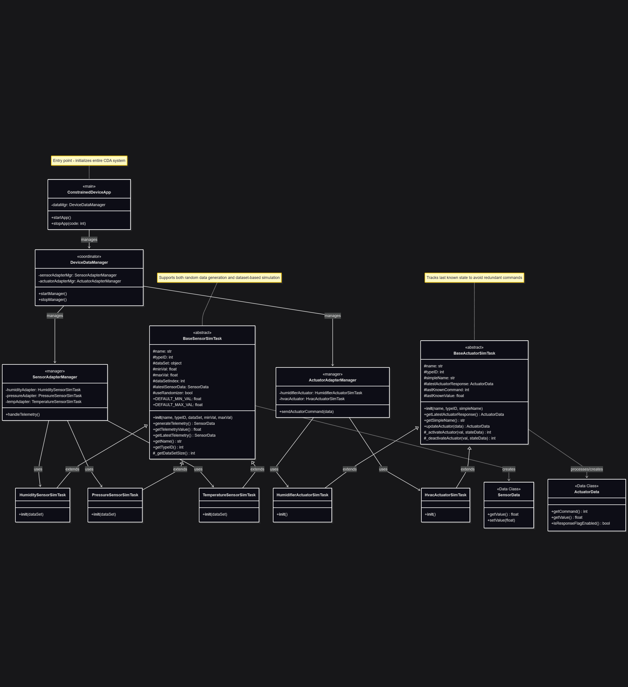
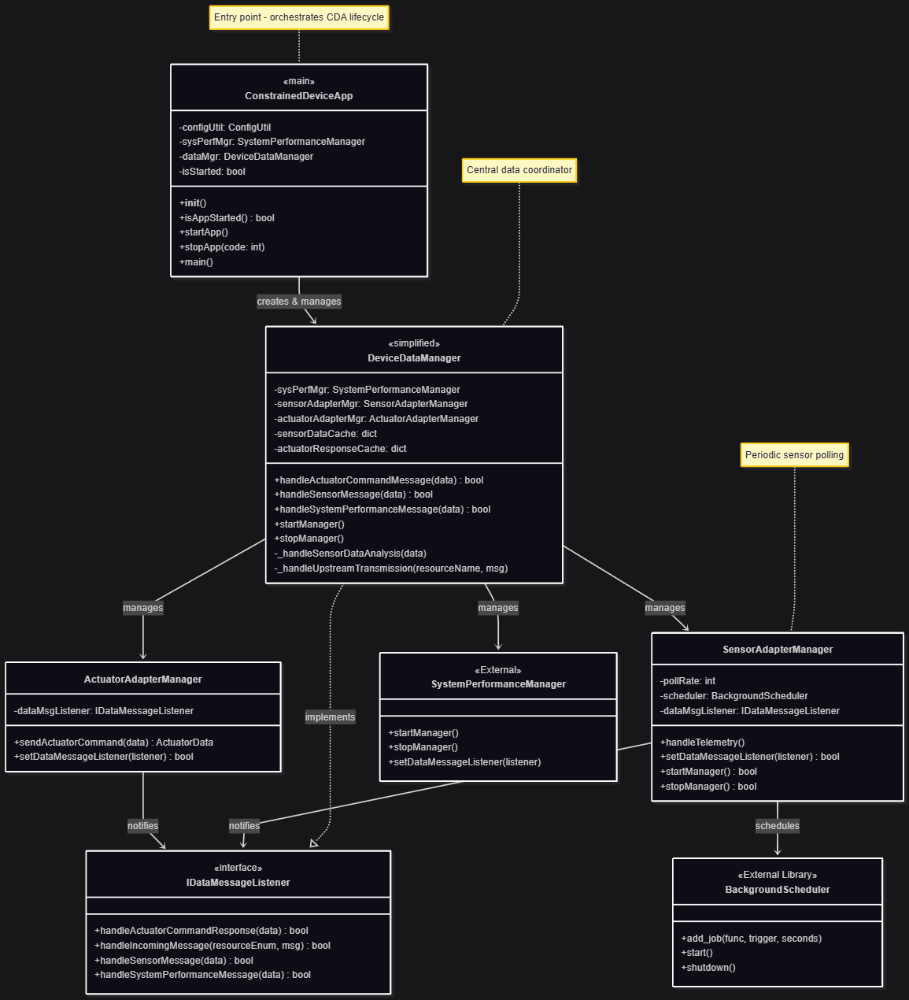

# Constrained Device Application (Connected Devices)

## Lab Module 03

Be sure to implement all the PIOT-CDA-* issues (requirements) listed at [PIOT-INF-03-001 - Lab Module 03](https://github.com/orgs/programming-the-iot/projects/1#column-10488379).

### Description

NOTE: Include two full paragraphs describing your implementation approach by answering the questions listed below.

What does your implementation do? 

A: Build data generator to simulate sensing and actuation in CDA

How does your implementation work?

A: 

Data Model Layer: Implement three concrete data classes - `SensorData` for sensor readings, `ActuatorData` for actuator commands responses, and `SystemPerformanceData` for system metrics

Simulation Layer: Complete `BaseSensorSimTask` for sensor simulation logic, then implement `TemperatureSensorSimTask`, `HumiditySensorSimTask`, and `PressureSensorSimTask`. Similarly, complete `BaseActuatorSimTask` for actuator control logic with state tracking, then implement `HvacActuatorSimTask` and `HumidifierActuatorSimTask`

Management Layer: Complete `SensorAdapterManager` to handle periodic sensor polling, `ActuatorAdapterManager` to dispatch actuator commands based on type ID, and finally link both to `DeviceDataManager`, handling local control logic and preparing data for upstream transmission.

### Code Repository and Branch

URL: https://github.com/BenderPL0120/TELE6530_ConstrainedDevice/tree/labmodule03

### UML Design Diagram(s)

### Unit Tests Executed

- test_ActuatorData
- test_SensorData
- test_SystemPerformanceData
- test_HumiditySensorSimTask
- test_PressureSensorSimTask
- test_TemperatureSensorSimTask
- test_HumidifierActuatorSimTask
- test_HvacActuatorSimTask

### Integration Tests Executed

- test_SensorAdapterManager
- test_DeviceDataManagerNoComms
- test_ConstrainedDeviceApp

EOF.
