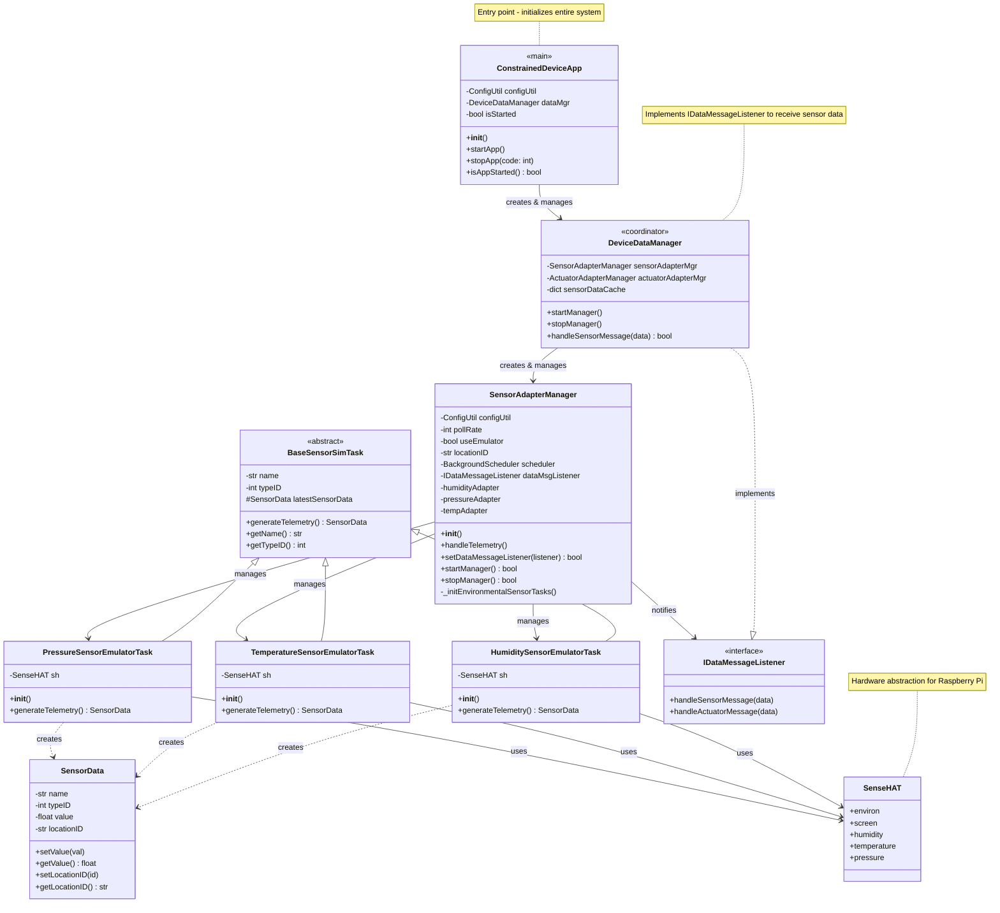

```mermaid
classDiagram
  class ConstrainedDeviceApp {
    <<main>>
    -ConfigUtil configUtil
    -DeviceDataManager dataMgr
    -bool isStarted
    +__init__()
    +startApp()
    +stopApp(code: int)
    +isAppStarted() bool
  }

  class DeviceDataManager {
    <<coordinator>>
    -SensorAdapterManager sensorAdapterMgr
    -ActuatorAdapterManager actuatorAdapterMgr
    -dict sensorDataCache
    +startManager()
    +stopManager()
    +handleSensorMessage(data) bool
  }

  class SensorAdapterManager {
    -ConfigUtil configUtil
    -int pollRate
    -bool useEmulator
    -str locationID
    -BackgroundScheduler scheduler
    -IDataMessageListener dataMsgListener
    -humidityAdapter
    -pressureAdapter
    -tempAdapter
    +__init__()
    +handleTelemetry()
    +setDataMessageListener(listener) bool
    +startManager() bool
    +stopManager() bool
    -_initEnvironmentalSensorTasks()
  }

  class BaseSensorSimTask {
    <<abstract>>
    -str name
    -int typeID
    #SensorData latestSensorData
    +generateTelemetry() SensorData
    +getName() str
    +getTypeID() int
  }

  class HumiditySensorEmulatorTask {
    -SenseHAT sh
    +__init__()
    +generateTelemetry() SensorData
  }

  class TemperatureSensorEmulatorTask {
    -SenseHAT sh
    +__init__()
    +generateTelemetry() SensorData
  }

  class PressureSensorEmulatorTask {
    -SenseHAT sh
    +__init__()
    +generateTelemetry() SensorData
  }

  class SensorData {
    -str name
    -int typeID
    -float value
    -str locationID
    +setValue(val)
    +getValue() float
    +setLocationID(id)
    +getLocationID() str
  }

  class SenseHAT {
    +environ
    +screen
    +humidity
    +temperature
    +pressure
  }

  class IDataMessageListener {
    <<interface>>
    +handleSensorMessage(data)
    +handleActuatorMessage(data)
  }

  ConstrainedDeviceApp --> DeviceDataManager : creates & manages
  DeviceDataManager --> SensorAdapterManager : creates & manages
  DeviceDataManager ..|> IDataMessageListener : implements

  BaseSensorSimTask <|-- HumiditySensorEmulatorTask
  BaseSensorSimTask <|-- TemperatureSensorEmulatorTask
  BaseSensorSimTask <|-- PressureSensorEmulatorTask
  
  SensorAdapterManager --> HumiditySensorEmulatorTask : manages
  SensorAdapterManager --> TemperatureSensorEmulatorTask : manages
  SensorAdapterManager --> PressureSensorEmulatorTask : manages
  SensorAdapterManager --> IDataMessageListener : notifies
  
  HumiditySensorEmulatorTask --> SenseHAT : uses
  TemperatureSensorEmulatorTask --> SenseHAT : uses
  PressureSensorEmulatorTask --> SenseHAT : uses
  
  HumiditySensorEmulatorTask ..> SensorData : creates
  TemperatureSensorEmulatorTask ..> SensorData : creates
  PressureSensorEmulatorTask ..> SensorData : creates

  note for ConstrainedDeviceApp "Entry point - initializes entire system"
  note for DeviceDataManager "Implements IDataMessageListener to receive sensor data"
  note for SenseHAT "Hardware abstraction for Raspberry Pi"
```
