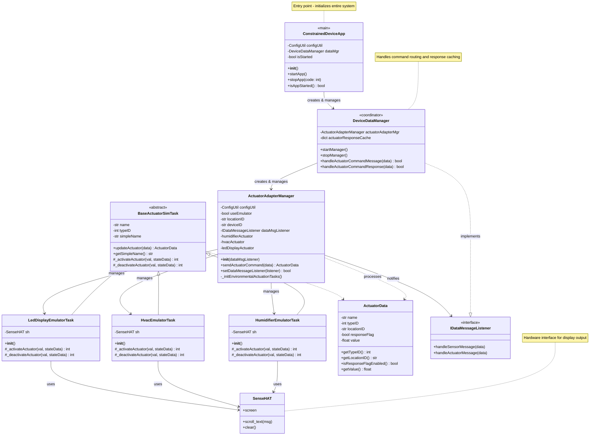

```mermaid
classDiagram
  class ConstrainedDeviceApp {
    <<main>>
    -ConfigUtil configUtil
    -DeviceDataManager dataMgr
    -bool isStarted
    +__init__()
    +startApp()
    +stopApp(code: int)
    +isAppStarted() bool
  }

  class DeviceDataManager {
    <<coordinator>>
    -ActuatorAdapterManager actuatorAdapterMgr
    -dict actuatorResponseCache
    +startManager()
    +stopManager()
    +handleActuatorCommandMessage(data) bool
    +handleActuatorCommandResponse(data) bool
  }

  class ActuatorAdapterManager {
    -ConfigUtil configUtil
    -bool useEmulator
    -str locationID
    -str deviceID
    -IDataMessageListener dataMsgListener
    -humidifierActuator
    -hvacActuator
    -ledDisplayActuator
    +__init__(dataMsgListener)
    +sendActuatorCommand(data) ActuatorData
    +setDataMessageListener(listener) bool
    -_initEnvironmentalActuationTasks()
  }

  class BaseActuatorSimTask {
    <<abstract>>
    -str name
    -int typeID
    -str simpleName
    +updateActuator(data) ActuatorData
    +getSimpleName() str
    #_activateActuator(val, stateData) int
    #_deactivateActuator(val, stateData) int
  }

  class HumidifierEmulatorTask {
    -SenseHAT sh
    +__init__()
    #_activateActuator(val, stateData) int
    #_deactivateActuator(val, stateData) int
  }

  class HvacEmulatorTask {
    -SenseHAT sh
    +__init__()
    #_activateActuator(val, stateData) int
    #_deactivateActuator(val, stateData) int
  }

  class LedDisplayEmulatorTask {
    -SenseHAT sh
    +__init__()
    #_activateActuator(val, stateData) int
    #_deactivateActuator(val, stateData) int
  }

  class ActuatorData {
    -str name
    -int typeID
    -str locationID
    -bool responseFlag
    -float value
    +getTypeID() int
    +getLocationID() str
    +isResponseFlagEnabled() bool
    +getValue() float
  }

  class SenseHAT {
    +screen
    +scroll_text(msg)
    +clear()
  }

  class IDataMessageListener {
    <<interface>>
    +handleSensorMessage(data)
    +handleActuatorMessage(data)
  }

  ConstrainedDeviceApp --> DeviceDataManager : creates & manages
  DeviceDataManager --> ActuatorAdapterManager : creates & manages
  DeviceDataManager ..|> IDataMessageListener : implements

  BaseActuatorSimTask <|-- HumidifierEmulatorTask
  BaseActuatorSimTask <|-- HvacEmulatorTask
  BaseActuatorSimTask <|-- LedDisplayEmulatorTask
  
  ActuatorAdapterManager --> HumidifierEmulatorTask : manages
  ActuatorAdapterManager --> HvacEmulatorTask : manages
  ActuatorAdapterManager --> LedDisplayEmulatorTask : manages
  ActuatorAdapterManager --> IDataMessageListener : notifies
  
  HumidifierEmulatorTask --> SenseHAT : uses
  HvacEmulatorTask --> SenseHAT : uses
  LedDisplayEmulatorTask --> SenseHAT : uses
  
  ActuatorAdapterManager ..> ActuatorData : processes
  BaseActuatorSimTask ..> ActuatorData : receives & returns

  note for ConstrainedDeviceApp "Entry point - initializes entire system"
  note for DeviceDataManager "Handles command routing and response caching"
  note for SenseHAT "Hardware interface for display output"
```