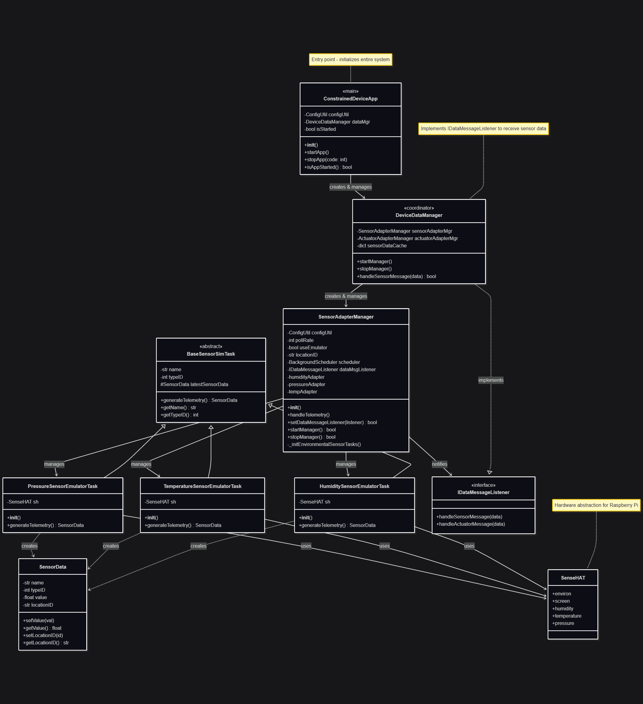
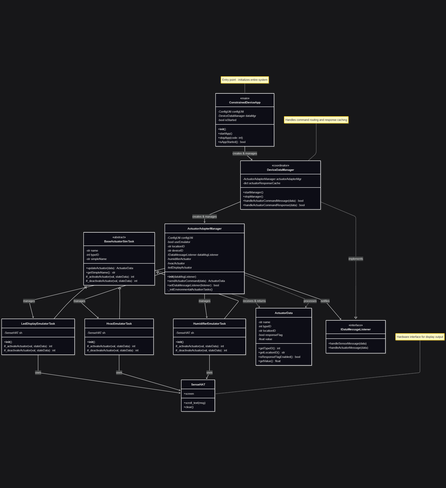

# Constrained Device Application (Connected Devices)

## Lab Module 04

Be sure to implement all the PIOT-CDA-* issues (requirements) listed at [PIOT-INF-04-001 - Lab Module 04](https://github.com/orgs/programming-the-iot/projects/1#column-10488386).

### Description

NOTE: Include two full paragraphs describing your implementation approach by answering the questions listed below.

What does your implementation do? 

A: Build cda emulator framework by using the SenseHAT emulator

How does your implementation work?

A: The code includes three sensor emulators (temperature, humidity, and pressure) that read environmental data from the SenseHAT's sensors and package them into SensorData objects. It also includes three actuator emulators (HVAC, humidifier, and LED display) that respond to control commands.

### Code Repository and Branch

URL: https://github.com/BenderPL0120/TELE6530_ConstrainedDevice/tree/labmodule04

### UML Design Diagram(s)

### Unit Tests Executed

- 
- 
- 

### Integration Tests Executed

- test_SenseHatEmulatorQuick 
- test_HumidityEmulatorTask
- test_PressureEmulatorTask
- test_TemperatureEmulatorTask
- test_HumidifierEmulatorTask
- test_HvacEmulatorTask
- test_LedDisplayEmulatorTask
- test_SensorEmulatorManager
- test_ActuatorAdapterManager

EOF.
