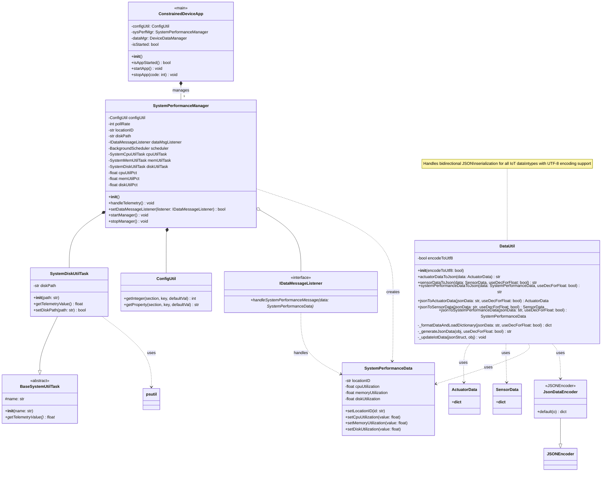

```mermaid
classDiagram
    class ConstrainedDeviceApp {
        <<main>>
        -configUtil: ConfigUtil
        -sysPerfMgr: SystemPerformanceManager
        -dataMgr: DeviceDataManager
        -isStarted: bool
        +__init__()
        +isAppStarted() bool
        +startApp() void
        +stopApp(code: int) void
    }
    class DataUtil {
        -bool encodeToUtf8
        +__init__(encodeToUtf8: bool)
        +actuatorDataToJson(data: ActuatorData) str
        +sensorDataToJson(data: SensorData, useDecForFloat: bool) str
        +systemPerformanceDataToJson(data: SystemPerformanceData, useDecForFloat: bool) str
        +jsonToActuatorData(jsonData: str, useDecForFloat: bool) ActuatorData
        +jsonToSensorData(jsonData: str, useDecForFloat: bool) SensorData
        +jsonToSystemPerformanceData(jsonData: str, useDecForFloat: bool) SystemPerformanceData
        -_formatDataAndLoadDictionary(jsonData: str, useDecForFloat: bool) dict
        -_generateJsonData(obj, useDecForFloat: bool) str
        -_updateIotData(jsonStruct, obj) void
    }

    class JsonDataEncoder {
        <<JSONEncoder>>
        +default(o) dict
    }

    class BaseSystemUtilTask {
        <<abstract>>
        #name: str
        +__init__(name: str)
        +getTelemetryValue()* float
    }

    class SystemDiskUtilTask {
        -str diskPath
        +__init__(path: str)
        +getTelemetryValue() float
        +setDiskPath(path: str) bool
    }

    class SystemPerformanceManager {
        -ConfigUtil configUtil
        -int pollRate
        -str locationID
        -str diskPath
        -IDataMessageListener dataMsgListener
        -BackgroundScheduler scheduler
        -SystemCpuUtilTask cpuUtilTask
        -SystemMemUtilTask memUtilTask
        -SystemDiskUtilTask diskUtilTask
        -float cpuUtilPct
        -float memUtilPct
        -float diskUtilPct
        +__init__()
        +handleTelemetry() void
        +setDataMessageListener(listener: IDataMessageListener) bool
        +startManager() void
        +stopManager() void
    }

    class SystemPerformanceData {
        -str locationID
        -float cpuUtilization
        -float memoryUtilization
        -float diskUtilization
        +setLocationID(id: str)
        +setCpuUtilization(value: float)
        +setMemoryUtilization(value: float)
        +setDiskUtilization(value: float)
    }

    class ActuatorData {
        +__dict__
    }

    class SensorData {
        +__dict__
    }

    class IDataMessageListener {
        <<interface>>
        +handleSystemPerformanceMessage(data: SystemPerformanceData)*
    }

    class ConfigUtil {
        +getInteger(section, key, defaultVal) int
        +getProperty(section, key, defaultVal) str
    }

    %% ConstrainedDeviceApp relationships
    ConstrainedDeviceApp *-- "1" SystemPerformanceManager : manages

    %% Inheritance relationships
    SystemDiskUtilTask --|> BaseSystemUtilTask
    JsonDataEncoder --|> JSONEncoder

    %% Composition relationships
    SystemPerformanceManager *-- SystemDiskUtilTask
    SystemPerformanceManager *-- ConfigUtil
    SystemPerformanceManager o-- IDataMessageListener

    %% Dependency relationships
    DataUtil ..> ActuatorData : uses
    DataUtil ..> SensorData : uses
    DataUtil ..> SystemPerformanceData : uses
    DataUtil ..> JsonDataEncoder : uses
    SystemPerformanceManager ..> SystemPerformanceData : creates
    SystemDiskUtilTask ..> psutil : uses
    IDataMessageListener ..> SystemPerformanceData : handles

    %% Notes
    note for DataUtil "Handles bidirectional JSON\nserialization for all IoT data\ntypes with UTF-8 encoding support"
```