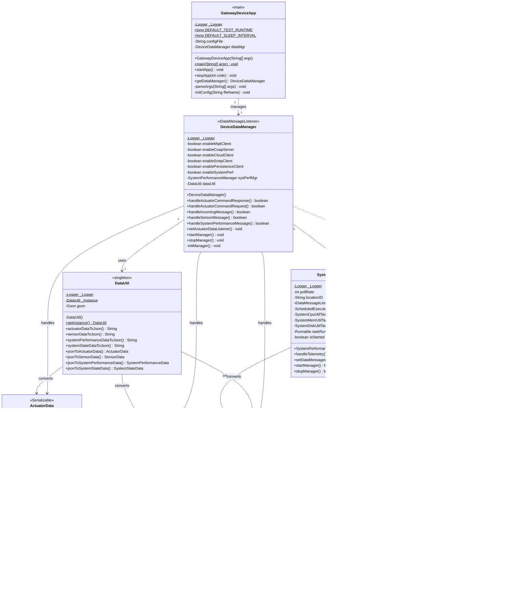

```mermaid
classDiagram
    class GatewayDeviceApp {
        <<main>>
        -Logger _Logger$
        +long DEFAULT_TEST_RUNTIME$
        +long DEFAULT_SLEEP_INTERVAL$
        -String configFile
        -DeviceDataManager dataMgr
        +GatewayDeviceApp(String[] args)
        +main(String[] args)$ void
        +startApp() void
        +stopApp(int code) void
        +getDataManager() DeviceDataManager
        -parseArgs(String[] args) void
        -initConfig(String fileName) void
    }

    class DeviceDataManager {
        <<IDataMessageListener>>
        -Logger _Logger$
        -boolean enableMqttClient
        -boolean enableCoapServer
        -boolean enableCloudClient
        -boolean enableSmtpClient
        -boolean enablePersistenceClient
        -boolean enableSystemPerf
        -SystemPerformanceManager sysPerfMgr
        -DataUtil dataUtil
        +DeviceDataManager()
        +handleActuatorCommandResponse() boolean
        +handleActuatorCommandRequest() boolean
        +handleIncomingMessage() boolean
        +handleSensorMessage() boolean
        +handleSystemPerformanceMessage() boolean
        +setActuatorDataListener() void
        +startManager() void
        +stopManager() void
        -initManager() void
    }

    class SystemPerformanceManager {
        -Logger _Logger$
        -int pollRate
        -String locationID
        -IDataMessageListener dataMsgListener
        -ScheduledExecutorService schedExecSvc
        -SystemCpuUtilTask sysCpuUtilTask
        -SystemMemUtilTask sysMemUtilTask
        -SystemDiskUtilTask sysDiskUtilTask
        -Runnable taskRunner
        -boolean isStarted
        +SystemPerformanceManager()
        +handleTelemetry() void
        +setDataMessageListener() void
        +startManager() boolean
        +stopManager() boolean
    }

    class SystemDiskUtilTask {
        -Logger _Logger$
        -File diskFile
        +SystemDiskUtilTask()
        +SystemDiskUtilTask(String path)
        +getTelemetryValue() float
    }

    class BaseSystemUtilTask {
        <<abstract>>
        +getTelemetryValue() float
    }

    class DataUtil {
        <<singleton>>
        -Logger _Logger$
        -DataUtil _Instance$
        -Gson gson
        -DataUtil()
        +getInstance()$ DataUtil
        +actuatorDataToJson() String
        +sensorDataToJson() String
        +systemPerformanceDataToJson() String
        +systemStateDataToJson() String
        +jsonToActuatorData() ActuatorData
        +jsonToSensorData() SensorData
        +jsonToSystemPerformanceData() SystemPerformanceData
        +jsonToSystemStateData() SystemStateData
    }

    class ActuatorData {
        <<Serializable>>
        -long serialVersionUID$
        -int command
        -float value
        -boolean isResponse
        -String stateData
        +ActuatorData()
        +getCommand() int
        +getValue() float
        +getStateData() String
        +isResponseFlagEnabled() boolean
        +setCommand() void
        +setValue() void
        +setStateData() void
        +setAsResponse() void
        +toString() String
        #handleUpdateData() void
    }

    class SensorData {
        <<Serializable>>
        -long serialVersionUID$
        -float value
        +SensorData()
        +SensorData(int sensorType)
        +getValue() float
        +setValue() void
        +toString() String
        #handleUpdateData() void
    }

    class SystemPerformanceData {
        <<Serializable>>
        -float cpuUtilization
        -float memoryUtilization
        -float diskUtilization
        +setCpuUtilization() void
        +setMemoryUtilization() void
        +setDiskUtilization() void
    }

    class BaseIotData {
        <<abstract>>
        -String name
        -int typeID
        -String locationID
        -long timeStamp
        #updateTimeStamp() void
        #handleUpdateData() void
    }

    class IDataMessageListener {
        <<interface>>
        +handleActuatorCommandResponse() boolean
        +handleActuatorCommandRequest() boolean
        +handleIncomingMessage() boolean
        +handleSensorMessage() boolean
        +handleSystemPerformanceMessage() boolean
    }

    GatewayDeviceApp "1" --> "1" DeviceDataManager : manages
    DeviceDataManager "1" --> "1" SystemPerformanceManager : monitors
    DeviceDataManager "1" --> "1" DataUtil : uses
    DeviceDataManager ..|> IDataMessageListener : implements
    
    SystemPerformanceManager "1" --> "1" SystemDiskUtilTask : uses
    SystemPerformanceManager "1" --> "1" IDataMessageListener : notifies
    SystemPerformanceManager --> SystemPerformanceData : creates
    
    SystemDiskUtilTask --|> BaseSystemUtilTask : extends
    
    DataUtil --> ActuatorData : converts
    DataUtil --> SensorData : converts
    DataUtil --> SystemPerformanceData : converts
    
    ActuatorData --|> BaseIotData : extends
    SensorData --|> BaseIotData : extends
    SystemPerformanceData --|> BaseIotData : extends
    
    DeviceDataManager --> ActuatorData : handles
    DeviceDataManager --> SensorData : handles
    DeviceDataManager --> SystemPerformanceData : handles
```