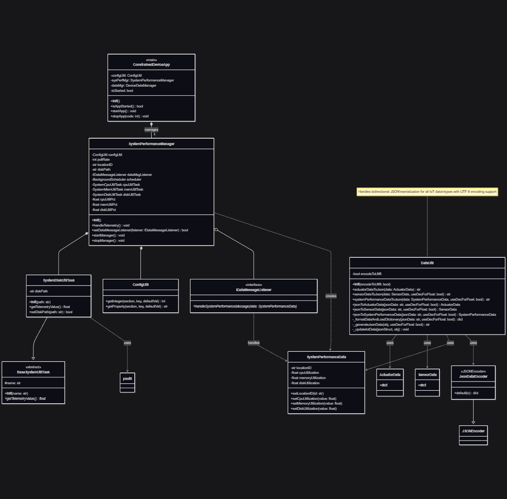

# Constrained Device Application (Connected Devices)

## Lab Module 05

Be sure to implement all the PIOT-CDA-* issues (requirements) listed at [PIOT-INF-05-001 - Lab Module 05](https://github.com/orgs/programming-the-iot/projects/1#column-10488421).

### Description

NOTE: Include two full paragraphs describing your implementation approach by answering the questions listed below.

What does your implementation do?

A: Realize a JSON serialization/deserialization system for CDA, and system monitoring framework that track disk utilization metric

How does your implementation work?

A:

`DataUtil`: A utility class providing JSON serialization/deserialization for IoT data objects.

`SystemDiskUtilTask`: Monitors filesystem disk utilization using `psutil`.

### Code Repository and Branch

URL: https://github.com/BenderPL0120/TELE6530_ConstrainedDevice/tree/labmodule05

### UML Design Diagram(s)

### Unit Tests Executed

- test_DataUtil
- 
- 

### Integration Tests Executed

- test_SystemPerformanceManager
- test_DataIntegrationTest
- 

EOF.
