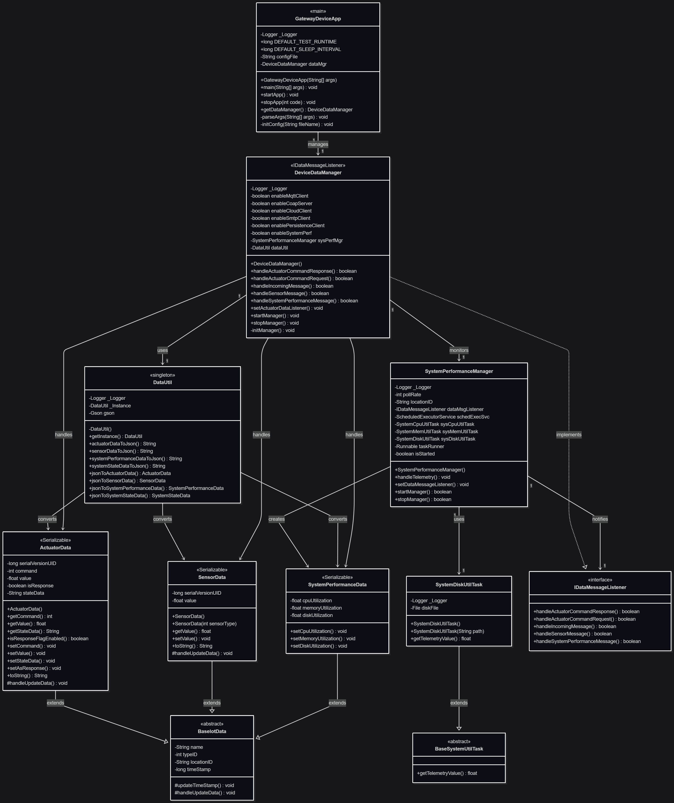

# Gateway Device Application (Connected Devices)

## Lab Module 05

Be sure to implement all the PIOT-GDA-* issues (requirements) listed at [PIOT-INF-05-001 - Lab Module 05](https://github.com/orgs/programming-the-iot/projects/1#column-10488421).

### Description

NOTE: Include two full paragraphs describing your implementation approach by answering the questions listed below.

What does your implementation do? 

A: Developed GDA featuring system performance monitoring, sensor/actuator data management, and multi-protocol communication support

How does your implementation work?

A: 

`SystemDiskUtilTask`: Calculates disk utilization percentage by monitoring used space. 

`SystemPerformanceManager`: Periodically collects CPU, memory, and disk metrics via scheduled tasks and forwards performance data to registered listeners`

`ActuatorData`: Encapsulates actuator command data

`SensorData`: Represents sensor measurement data with value tracking and timestamp management

`DeviceDataManager`: Manages all protocol connections and routing telemetry messages between system components

### Code Repository and Branch

URL: https://github.com/BenderPL0120/TELE6530_GatewayDevice/tree/labmodule05

### UML Design Diagram(s)

### Unit Tests Executed

- ActuatorDataTest
- SensorDataTest
- SystemPerformanceDataTest

### Integration Tests Executed

- SystemPerformanceManagerTest
- DataIntegrationTest
- DeviceDataManagerNoCommsTest
- GatewayDeviceAppTest
EOF.
