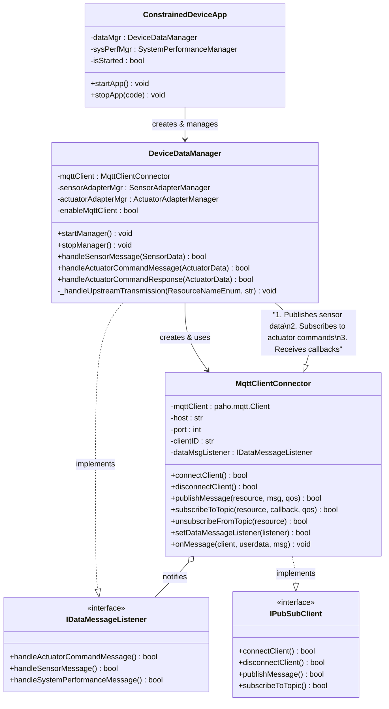

```mermaid
classDiagram
    %% Main Application
    class ConstrainedDeviceApp {
        -dataMgr : DeviceDataManager
        -sysPerfMgr : SystemPerformanceManager
        -isStarted : bool
        +startApp() void
        +stopApp(code) void
    }

    %% Core Manager
    class DeviceDataManager {
        -mqttClient : MqttClientConnector
        -sensorAdapterMgr : SensorAdapterManager
        -actuatorAdapterMgr : ActuatorAdapterManager
        -enableMqttClient : bool
        +startManager() void
        +stopManager() void
        +handleSensorMessage(SensorData) bool
        +handleActuatorCommandMessage(ActuatorData) bool
        +handleActuatorCommandResponse(ActuatorData) bool
        -_handleUpstreamTransmission(ResourceNameEnum, str) void
    }

    %% MQTT Connector
    class MqttClientConnector {
        -mqttClient : paho.mqtt.Client
        -host : str
        -port : int
        -clientID : str
        -dataMsgListener : IDataMessageListener
        +connectClient() bool
        +disconnectClient() bool
        +publishMessage(resource, msg, qos) bool
        +subscribeToTopic(resource, callback, qos) bool
        +unsubscribeFromTopic(resource) bool
        +setDataMessageListener(listener) bool
        +onMessage(client, userdata, msg) void
    }

    %% Key Interfaces
    class IDataMessageListener {
        <<interface>>
        +handleActuatorCommandMessage() bool
        +handleSensorMessage() bool
        +handleSystemPerformanceMessage() bool
    }

    class IPubSubClient {
        <<interface>>
        +connectClient() bool
        +disconnectClient() bool
        +publishMessage() bool
        +subscribeToTopic() bool
    }

    %% Relationships
    ConstrainedDeviceApp --> DeviceDataManager : creates & manages
    DeviceDataManager ..|> IDataMessageListener : implements
    DeviceDataManager --> MqttClientConnector : creates & uses
    MqttClientConnector ..|> IPubSubClient : implements
    MqttClientConnector o-- IDataMessageListener : notifies
    
    %% Key interaction flow
    DeviceDataManager --|> MqttClientConnector : "1. Publishes sensor data\n2. Subscribes to actuator commands\n3. Receives callbacks"
```