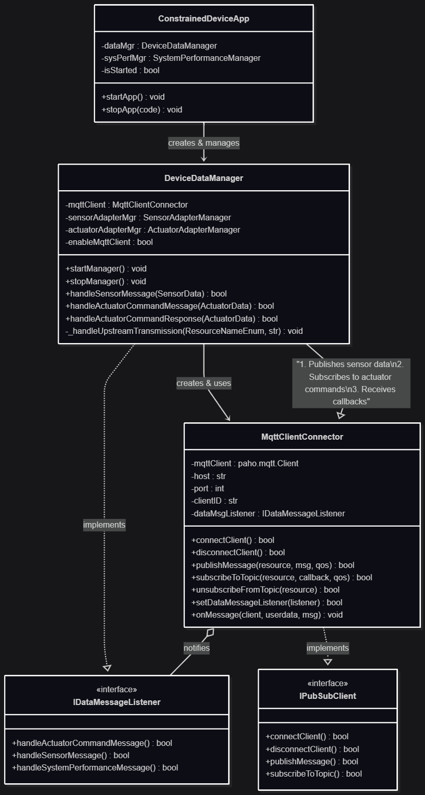

# Constrained Device Application (Connected Devices)

## Lab Module 06

Be sure to implement all the PIOT-CDA-* issues (requirements) listed at [PIOT-INF-06-001 - Lab Module 06](https://github.com/orgs/programming-the-iot/projects/1#column-10488434).

### Description

NOTE: Include two full paragraphs describing your implementation approach by answering the questions listed below.

What does your implementation do? 

A: Implemented a basic MQTT client connector for CDA with core publish/subscribe functionalityA: 

How does your implementation work?

A: `MqttClientConnector` serves as the MQTT communication interface for CDA. It provides asynchronous MQTT operation such as connection management, publishing, subscribing, callbacks and configuration.

### Code Repository and Branch

URL: https://github.com/BenderPL0120/TELE6530_ConstrainedDevice/tree/labmodule06

### UML Design Diagram(s)

### Unit Tests Executed

- 
- 
- 

### Integration Tests Executed

- test_MqttClientConnector(testConnectAndDisconnect)
- test_MqttClientConnector(testConnectAndCDAManagementStatusPubSub)
- test_MqttClientConnector(testActuatorCmdPubSub)

EOF.
