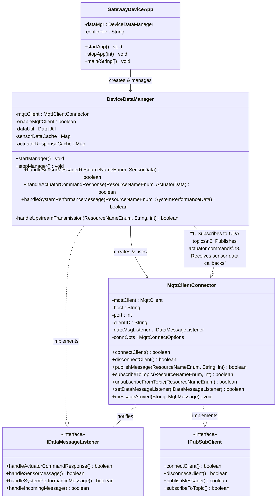

```mermaid
classDiagram
    %% Main Application
    class GatewayDeviceApp {
        -dataMgr : DeviceDataManager
        -configFile : String
        +startApp() void
        +stopApp(int) void
        +main(String[]) void
    }

    %% Core Manager
    class DeviceDataManager {
        -mqttClient : MqttClientConnector
        -enableMqttClient : boolean
        -dataUtil : DataUtil
        -sensorDataCache : Map
        -actuatorResponseCache : Map
        +startManager() void
        +stopManager() void
        +handleSensorMessage(ResourceNameEnum, SensorData) boolean
        +handleActuatorCommandResponse(ResourceNameEnum, ActuatorData) boolean
        +handleSystemPerformanceMessage(ResourceNameEnum, SystemPerformanceData) boolean
        -handleUpstreamTransmission(ResourceNameEnum, String, int) boolean
    }

    %% MQTT Connector  
    class MqttClientConnector {
        -mqttClient : MqttClient
        -host : String
        -port : int
        -clientID : String
        -dataMsgListener : IDataMessageListener
        -connOpts : MqttConnectOptions
        +connectClient() boolean
        +disconnectClient() boolean
        +publishMessage(ResourceNameEnum, String, int) boolean
        +subscribeToTopic(ResourceNameEnum, int) boolean
        +unsubscribeFromTopic(ResourceNameEnum) boolean
        +setDataMessageListener(IDataMessageListener) boolean
        +messageArrived(String, MqttMessage) void
    }

    %% Key Interfaces
    class IDataMessageListener {
        <<interface>>
        +handleActuatorCommandResponse() boolean
        +handleSensorMessage() boolean
        +handleSystemPerformanceMessage() boolean
        +handleIncomingMessage() boolean
    }

    class IPubSubClient {
        <<interface>>
        +connectClient() boolean
        +disconnectClient() boolean
        +publishMessage() boolean
        +subscribeToTopic() boolean
    }

    %% Relationships
    GatewayDeviceApp --> DeviceDataManager : creates & manages
    DeviceDataManager ..|> IDataMessageListener : implements
    DeviceDataManager --> MqttClientConnector : creates & uses
    MqttClientConnector ..|> IPubSubClient : implements
    MqttClientConnector o-- IDataMessageListener : notifies
    
    %% Key interaction flow
    DeviceDataManager --|> MqttClientConnector : "1. Subscribes to CDA topics\n2. Publishes actuator commands\n3. Receives sensor data callbacks"
```