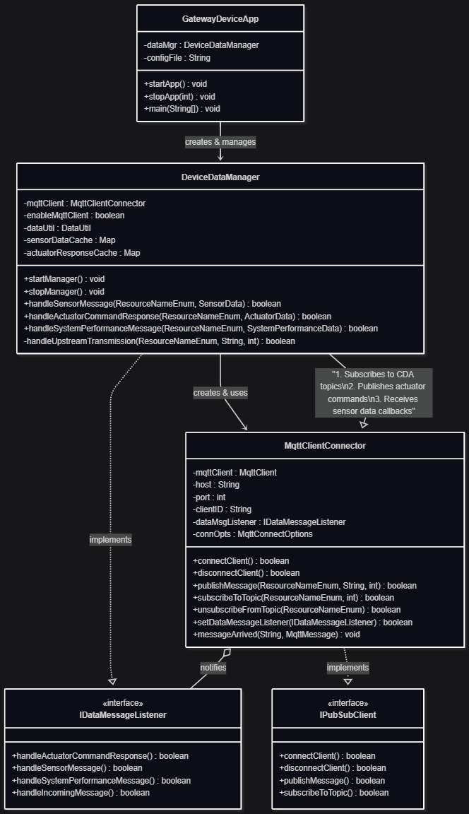

# Gateway Device Application (Connected Devices)

## Lab Module 07

Be sure to implement all the PIOT-GDA-* issues (requirements) listed at [PIOT-INF-07-001 - Lab Module 07](https://github.com/orgs/programming-the-iot/projects/1#column-10488499).

### Description

NOTE: Include two full paragraphs describing your implementation approach by answering the questions listed below.

What does your implementation do? 

A: Implemented a basic MQTT client connector for GDA with core publish/subscribe functionality

How does your implementation work?

A: `MqttClientConnector` serves as the MQTT communication interface for GDA. It provides connection management, publishing, subscribing, callbacks and configuration.

### Code Repository and Branch

URL: https://github.com/BenderPL0120/TELE6530_GatewayDevice/tree/labmodule07

### UML Design Diagram(s)

### Unit Tests Executed

- 
- 
- 

### Integration Tests Executed

- MqttClientConnectorTest(testConnectAndDisconnect)
- MqttClientConnectorTest(testPublishAndSubscribe)
- 

EOF.
