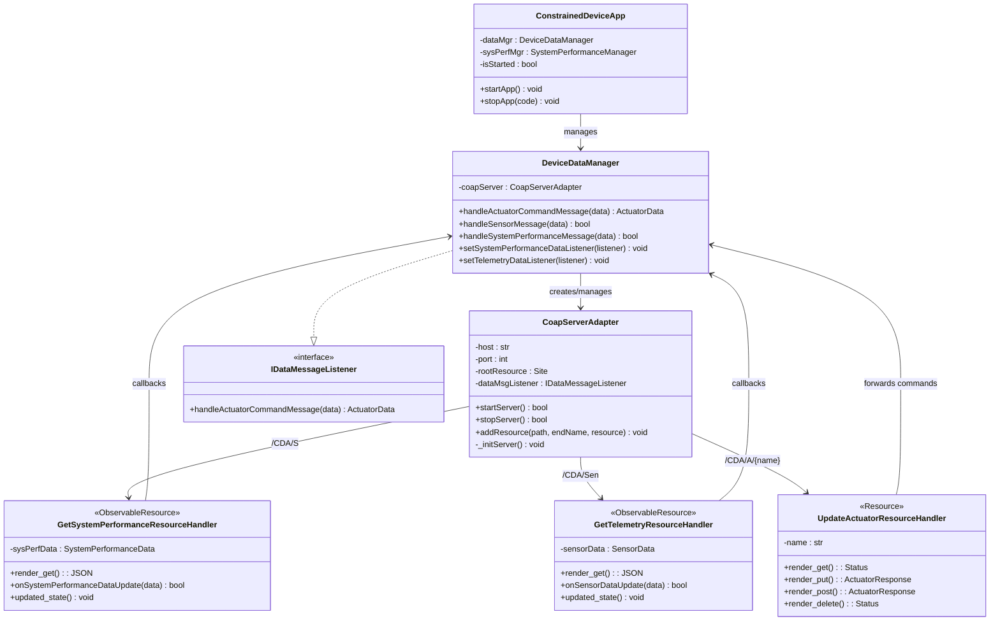

```mermaid
classDiagram
    %% Main Application
    class ConstrainedDeviceApp {
        -dataMgr : DeviceDataManager
        -sysPerfMgr : SystemPerformanceManager
        -isStarted : bool
        +startApp() void
        +stopApp(code) void
    }

    %% Device Management Layer
    class DeviceDataManager {
        -coapServer : CoapServerAdapter
        +handleActuatorCommandMessage(data) ActuatorData
        +handleSensorMessage(data) bool
        +handleSystemPerformanceMessage(data) bool
        +setSystemPerformanceDataListener(listener) void
        +setTelemetryDataListener(listener) void
    }

    %% CoAP Server Core
    class CoapServerAdapter {
        -host : str
        -port : int
        -rootResource : Site
        -dataMsgListener : IDataMessageListener
        +startServer() bool
        +stopServer() bool
        +addResource(path, endName, resource) void
        -_initServer() void
    }

    %% CoAP Resource Handlers
    class GetSystemPerformanceResourceHandler {
        <<ObservableResource>>
        -sysPerfData : SystemPerformanceData
        +render_get() : JSON
        +onSystemPerformanceDataUpdate(data) bool
        +updated_state() void
    }

    class GetTelemetryResourceHandler {
        <<ObservableResource>>
        -sensorData : SensorData
        +render_get() : JSON
        +onSensorDataUpdate(data) bool
        +updated_state() void
    }

    class UpdateActuatorResourceHandler {
        <<Resource>>
        -name : str
        +render_get() : Status
        +render_put() : ActuatorResponse
        +render_post() : ActuatorResponse
        +render_delete() : Status
    }

    %% Interface
    class IDataMessageListener {
        <<interface>>
        +handleActuatorCommandMessage(data) ActuatorData
    }

    %% Relationships
    ConstrainedDeviceApp --> DeviceDataManager : manages
    
    DeviceDataManager ..|> IDataMessageListener
    DeviceDataManager --> CoapServerAdapter : creates/manages

    CoapServerAdapter --> GetSystemPerformanceResourceHandler : /CDA/S
    CoapServerAdapter --> GetTelemetryResourceHandler : /CDA/Sen
    CoapServerAdapter --> UpdateActuatorResourceHandler : /CDA/A/{name}
    
    GetSystemPerformanceResourceHandler --> DeviceDataManager : callbacks
    GetTelemetryResourceHandler --> DeviceDataManager : callbacks
    UpdateActuatorResourceHandler --> DeviceDataManager : forwards commands
```