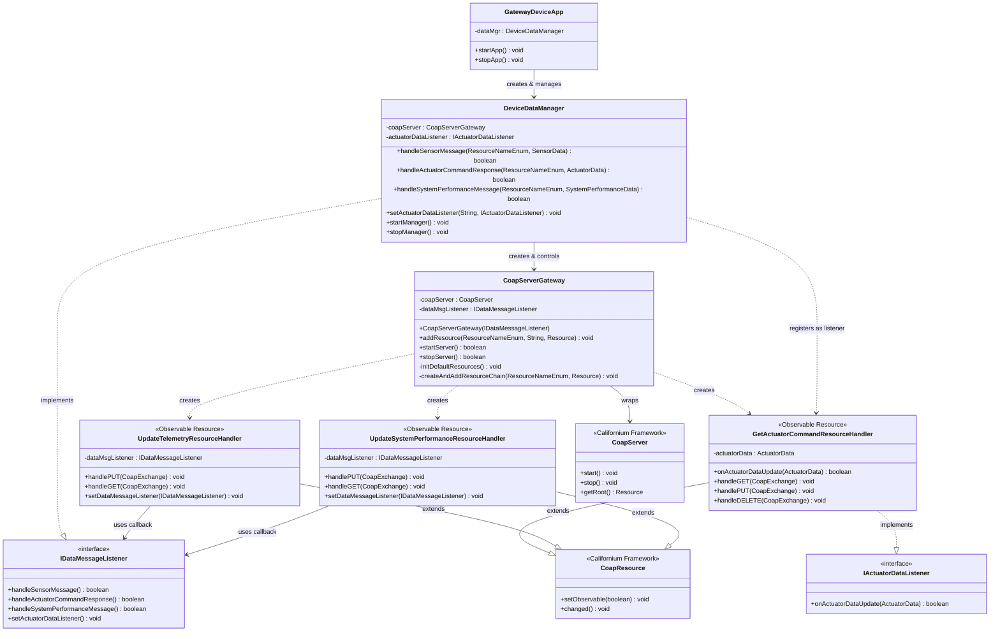

```mermaid
classDiagram
    %% Application Core
    class GatewayDeviceApp {
        -dataMgr : DeviceDataManager
        +startApp() void
        +stopApp() void
    }

    class DeviceDataManager {
        -coapServer : CoapServerGateway
        -actuatorDataListener : IActuatorDataListener
        +handleSensorMessage(ResourceNameEnum, SensorData) boolean
        +handleActuatorCommandResponse(ResourceNameEnum, ActuatorData) boolean
        +handleSystemPerformanceMessage(ResourceNameEnum, SystemPerformanceData) boolean
        +setActuatorDataListener(String, IActuatorDataListener) void
        +startManager() void
        +stopManager() void
    }

    %% CoAP Server Core Component
    class CoapServerGateway {
        -coapServer : CoapServer
        -dataMsgListener : IDataMessageListener
        +CoapServerGateway(IDataMessageListener)
        +addResource(ResourceNameEnum, String, Resource) void
        +startServer() boolean
        +stopServer() boolean
        -initDefaultResources() void
        -createAndAddResourceChain(ResourceNameEnum, Resource) void
    }

    %% CoAP Resource Handlers
    class GetActuatorCommandResourceHandler {
        <<Observable Resource>>
        -actuatorData : ActuatorData
        +onActuatorDataUpdate(ActuatorData) boolean
        +handleGET(CoapExchange) void
        +handlePUT(CoapExchange) void
        +handleDELETE(CoapExchange) void
    }

    class UpdateTelemetryResourceHandler {
        <<Observable Resource>>
        -dataMsgListener : IDataMessageListener
        +handlePUT(CoapExchange) void
        +handleGET(CoapExchange) void
        +setDataMessageListener(IDataMessageListener) void
    }

    class UpdateSystemPerformanceResourceHandler {
        <<Observable Resource>>
        -dataMsgListener : IDataMessageListener
        +handlePUT(CoapExchange) void
        +handleGET(CoapExchange) void
        +setDataMessageListener(IDataMessageListener) void
    }

    %% Key Interfaces
    class IDataMessageListener {
        <<interface>>
        +handleSensorMessage() boolean
        +handleActuatorCommandResponse() boolean
        +handleSystemPerformanceMessage() boolean
        +setActuatorDataListener() void
    }

    class IActuatorDataListener {
        <<interface>>
        +onActuatorDataUpdate(ActuatorData) boolean
    }

    %% Californium Framework
    class CoapResource {
        <<Californium Framework>>
        +setObservable(boolean) void
        +changed() void
    }

    class CoapServer {
        <<Californium Framework>>
        +start() void
        +stop() void
        +getRoot() Resource
    }

    %% Relationships
    GatewayDeviceApp --> DeviceDataManager : creates & manages
    DeviceDataManager ..|> IDataMessageListener : implements
    DeviceDataManager --> CoapServerGateway : creates & controls
    
    CoapServerGateway --> CoapServer : wraps
    CoapServerGateway ..> GetActuatorCommandResourceHandler : creates
    CoapServerGateway ..> UpdateTelemetryResourceHandler : creates
    CoapServerGateway ..> UpdateSystemPerformanceResourceHandler : creates
    
    GetActuatorCommandResourceHandler --|> CoapResource : extends
    GetActuatorCommandResourceHandler ..|> IActuatorDataListener : implements
    
    UpdateTelemetryResourceHandler --|> CoapResource : extends
    UpdateSystemPerformanceResourceHandler --|> CoapResource : extends
    
    UpdateTelemetryResourceHandler --> IDataMessageListener : uses callback
    UpdateSystemPerformanceResourceHandler --> IDataMessageListener : uses callback
    
    DeviceDataManager ..> GetActuatorCommandResourceHandler : registers as listener
```