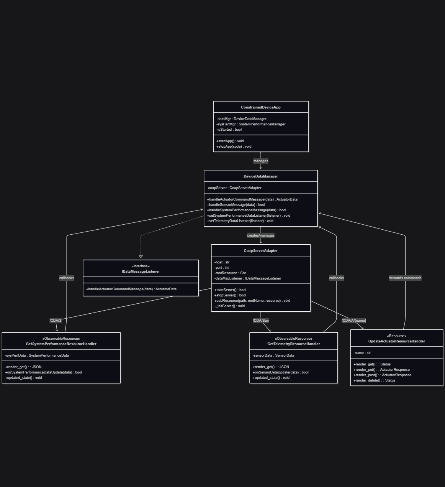

# Constrained Device Application (Connected Devices)

## Lab Module 08

Be sure to implement all the PIOT-CDA-* issues (requirements) listed at [PIOT-INF-08-001 - Lab Module 08](https://github.com/orgs/programming-the-iot/projects/1#column-10488501).

### Description

NOTE: Include two full paragraphs describing your implementation approach by answering the questions listed below.

What does your implementation do? 

A: CoAP server for system performance monitoring, sensor telemetry collection, and actuator command processing. The server uses resource handlers to expose device data and accept control commands through standard CoAP methods (GET/PUT/POST/DELETE).

How does your implementation work?

A: The `CoapServerAdapter` creates an async CoAP server using aiocoap that registers three types of resource handlers - `GetSystemPerformanceResourceHandler` and `GetTelemetryResourceHandler` act as observable resources that automatically notify subscribers when data updates occur, while `UpdateActuatorResourceHandler` processes incoming JSON commands and returns response status. All handlers interface with a data message listener that bridges between the CoAP protocol layer and the actual device/sensor management logic.

### Code Repository and Branch

URL: https://github.com/BenderPL0120/TELE6530_ConstrainedDevice/tree/labmodule08

### UML Design Diagram(s)

### Unit Tests Executed

- 
- 
- 

### Integration Tests Executed

- test_CoapServerAdapter
- 
- 

EOF.
