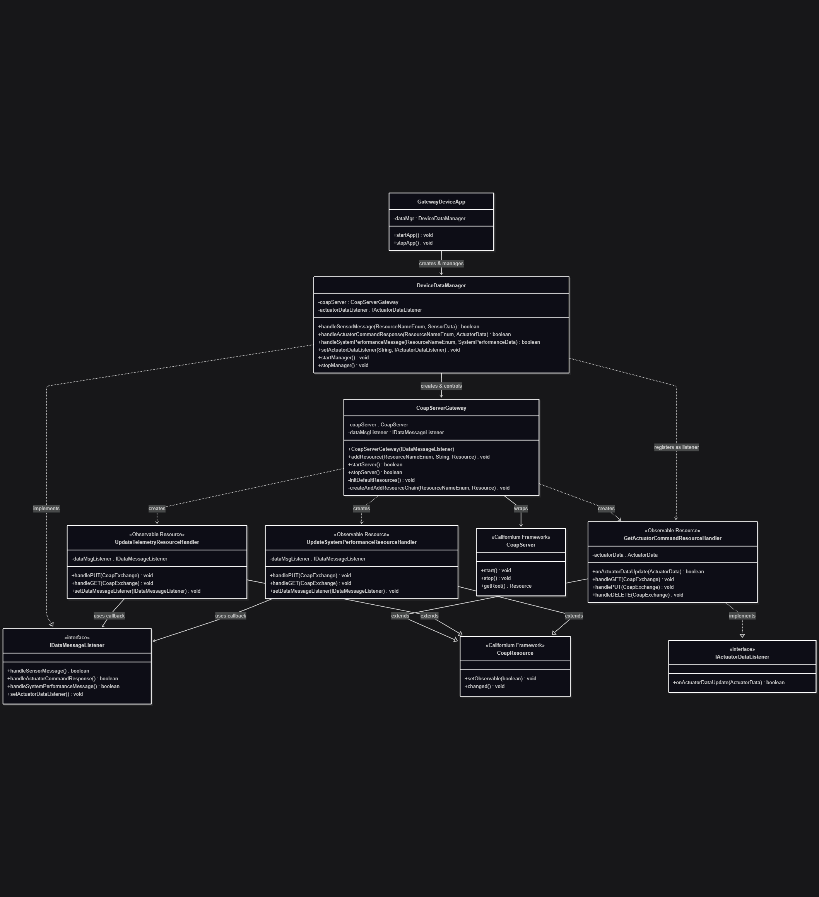

# Gateway Device Application (Connected Devices)

## Lab Module 08

Be sure to implement all the PIOT-GDA-* issues (requirements) listed at [PIOT-INF-08-001 - Lab Module 08](https://github.com/orgs/programming-the-iot/projects/1#column-10488501).

### Description

NOTE: Include two full paragraphs describing your implementation approach by answering the questions listed below.

What does your implementation do? 

A: CoAP server gateway that receives telemetry data from IoT devices via PUT requests, and provides actuator commands back to devices via GET requests with support for the CoAP Observe pattern for real-time updates.

How does your implementation work?

A: The `CoapServerGateway` creates a hierarchical resource tree with specialized handlers - `UpdateTelemetryResourceHandler` and `UpdateSystemPerformanceResourceHandler` process incoming PUT requests with JSON payloads from constrained devices, while `GetActuatorCommandResourceHandler` serves actuator commands via GET requests and automatically notifies observing clients when commands change through the CoAP Observable mechanism.

### Code Repository and Branch

URL: https://github.com/BenderPL0120/TELE6530_GatewayDevice/tree/labmodule08

### UML Design Diagram(s)

### Unit Tests Executed

- 
- 
- 

### Integration Tests Executed

- CoapServerGatewayTest
- 
- 

EOF.
