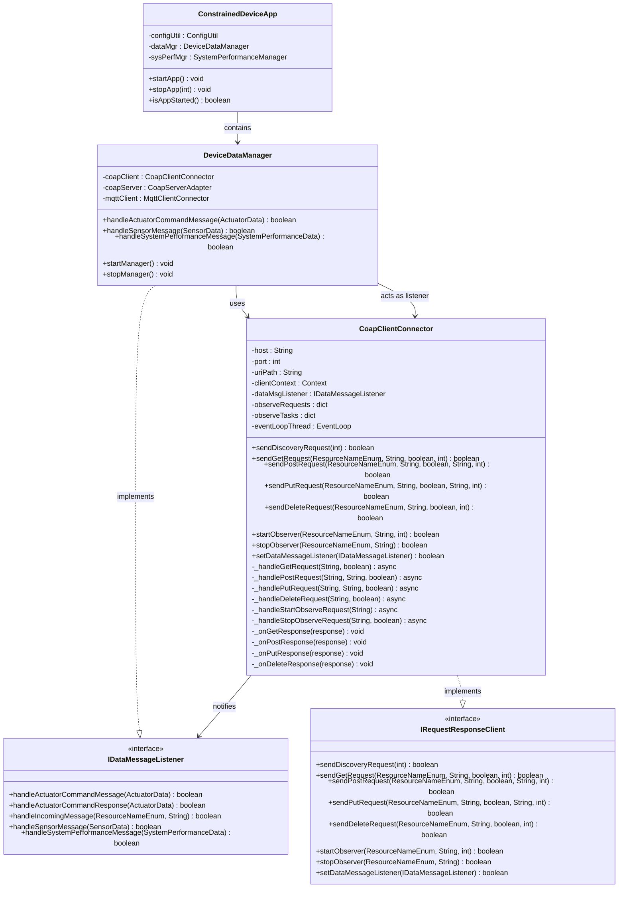

```mermaid
classDiagram
    %% Application Core
    class ConstrainedDeviceApp {
        -configUtil : ConfigUtil
        -dataMgr : DeviceDataManager
        -sysPerfMgr : SystemPerformanceManager
        +startApp() void
        +stopApp(int) void
        +isAppStarted() boolean
    }
    
    class DeviceDataManager {
        -coapClient : CoapClientConnector
        -coapServer : CoapServerAdapter
        -mqttClient : MqttClientConnector
        +handleActuatorCommandMessage(ActuatorData) boolean
        +handleSensorMessage(SensorData) boolean
        +handleSystemPerformanceMessage(SystemPerformanceData) boolean
        +startManager() void
        +stopManager() void
    }
    
    %% CoAP Client Details
    class CoapClientConnector {
        -host : String
        -port : int
        -uriPath : String
        -clientContext : Context
        -dataMsgListener : IDataMessageListener
        -observeRequests : dict
        -observeTasks : dict
        -eventLoopThread : EventLoop
        +sendDiscoveryRequest(int) boolean
        +sendGetRequest(ResourceNameEnum, String, boolean, int) boolean
        +sendPostRequest(ResourceNameEnum, String, boolean, String, int) boolean
        +sendPutRequest(ResourceNameEnum, String, boolean, String, int) boolean
        +sendDeleteRequest(ResourceNameEnum, String, boolean, int) boolean
        +startObserver(ResourceNameEnum, String, int) boolean
        +stopObserver(ResourceNameEnum, String) boolean
        +setDataMessageListener(IDataMessageListener) boolean
        -_handleGetRequest(String, boolean) async
        -_handlePostRequest(String, String, boolean) async
        -_handlePutRequest(String, String, boolean) async
        -_handleDeleteRequest(String, boolean) async
        -_handleStartObserveRequest(String) async
        -_handleStopObserveRequest(String, boolean) async
        -_onGetResponse(response) void
        -_onPostResponse(response) void
        -_onPutResponse(response) void
        -_onDeleteResponse(response) void
    }
    
    %% Interfaces
    class IRequestResponseClient {
        <<interface>>
        +sendDiscoveryRequest(int) boolean
        +sendGetRequest(ResourceNameEnum, String, boolean, int) boolean
        +sendPostRequest(ResourceNameEnum, String, boolean, String, int) boolean
        +sendPutRequest(ResourceNameEnum, String, boolean, String, int) boolean
        +sendDeleteRequest(ResourceNameEnum, String, boolean, int) boolean
        +startObserver(ResourceNameEnum, String, int) boolean
        +stopObserver(ResourceNameEnum, String) boolean
        +setDataMessageListener(IDataMessageListener) boolean
    }
    
    class IDataMessageListener {
        <<interface>>
        +handleActuatorCommandMessage(ActuatorData) boolean
        +handleActuatorCommandResponse(ActuatorData) boolean
        +handleIncomingMessage(ResourceNameEnum, String) boolean
        +handleSensorMessage(SensorData) boolean
        +handleSystemPerformanceMessage(SystemPerformanceData) boolean
    }
    
    %% Relationships
    ConstrainedDeviceApp --> DeviceDataManager : contains
    DeviceDataManager ..|> IDataMessageListener : implements
    DeviceDataManager --> CoapClientConnector : uses
    CoapClientConnector ..|> IRequestResponseClient : implements
    CoapClientConnector --> IDataMessageListener : notifies
    DeviceDataManager --> CoapClientConnector : acts as listener
```