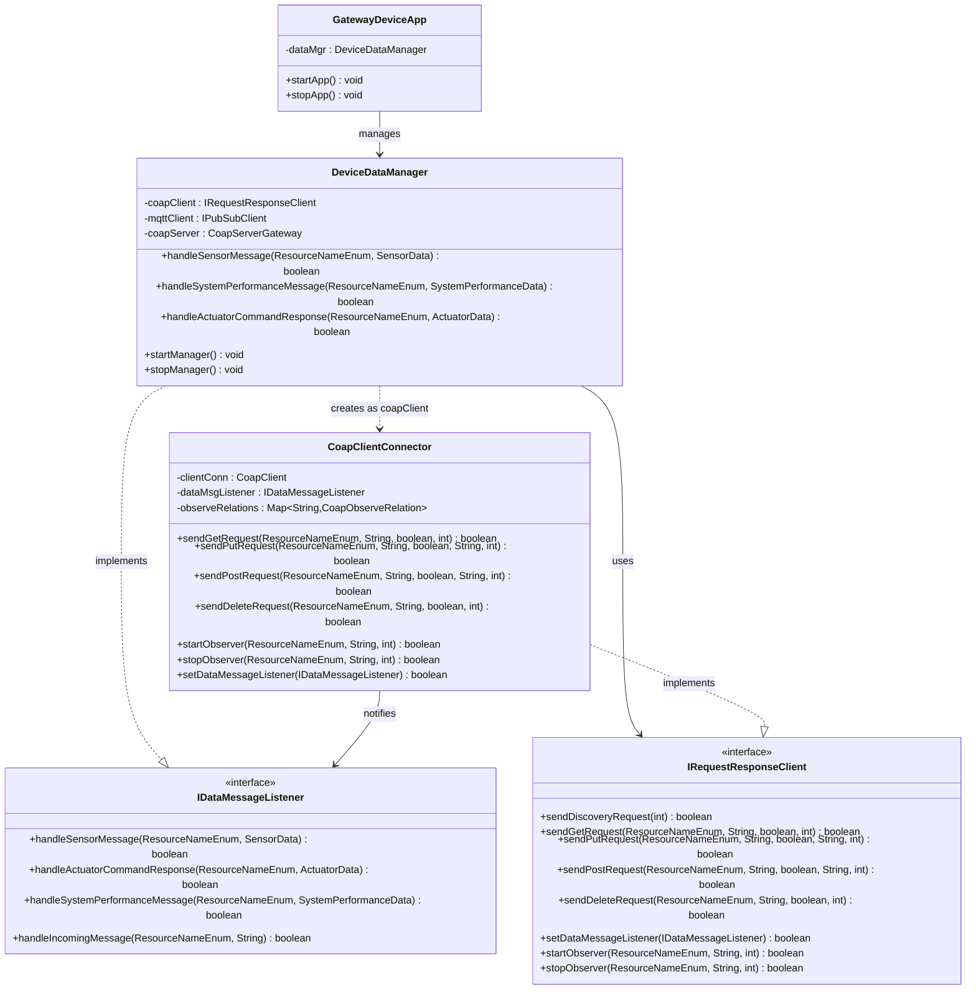

```mermaid
classDiagram
    %% Application Core
    class GatewayDeviceApp {
        -dataMgr : DeviceDataManager
        +startApp() void
        +stopApp() void
    }
    
    class DeviceDataManager {
        -coapClient : IRequestResponseClient
        -mqttClient : IPubSubClient
        -coapServer : CoapServerGateway
        +handleSensorMessage(ResourceNameEnum, SensorData) boolean
        +handleSystemPerformanceMessage(ResourceNameEnum, SystemPerformanceData) boolean
        +handleActuatorCommandResponse(ResourceNameEnum, ActuatorData) boolean
        +startManager() void
        +stopManager() void
    }
    
    %% CoAP Client Components
    class CoapClientConnector {
        -clientConn : CoapClient
        -dataMsgListener : IDataMessageListener
        -observeRelations : Map~String,CoapObserveRelation~
        +sendGetRequest(ResourceNameEnum, String, boolean, int) boolean
        +sendPutRequest(ResourceNameEnum, String, boolean, String, int) boolean
        +sendPostRequest(ResourceNameEnum, String, boolean, String, int) boolean
        +sendDeleteRequest(ResourceNameEnum, String, boolean, int) boolean
        +startObserver(ResourceNameEnum, String, int) boolean
        +stopObserver(ResourceNameEnum, String, int) boolean
        +setDataMessageListener(IDataMessageListener) boolean
    }
    
    %% Interfaces
    class IRequestResponseClient {
        <<interface>>
        +sendDiscoveryRequest(int) boolean
        +sendGetRequest(ResourceNameEnum, String, boolean, int) boolean
        +sendPutRequest(ResourceNameEnum, String, boolean, String, int) boolean
        +sendPostRequest(ResourceNameEnum, String, boolean, String, int) boolean
        +sendDeleteRequest(ResourceNameEnum, String, boolean, int) boolean
        +setDataMessageListener(IDataMessageListener) boolean
        +startObserver(ResourceNameEnum, String, int) boolean
        +stopObserver(ResourceNameEnum, String, int) boolean
    }
    
    class IDataMessageListener {
        <<interface>>
        +handleSensorMessage(ResourceNameEnum, SensorData) boolean
        +handleActuatorCommandResponse(ResourceNameEnum, ActuatorData) boolean
        +handleSystemPerformanceMessage(ResourceNameEnum, SystemPerformanceData) boolean
        +handleIncomingMessage(ResourceNameEnum, String) boolean
    }
    
    %% Relationships
    GatewayDeviceApp --> DeviceDataManager : manages
    DeviceDataManager ..|> IDataMessageListener : implements
    DeviceDataManager --> IRequestResponseClient : uses
    CoapClientConnector ..|> IRequestResponseClient : implements
    CoapClientConnector --> IDataMessageListener : notifies
    DeviceDataManager ..> CoapClientConnector : creates as coapClient
```