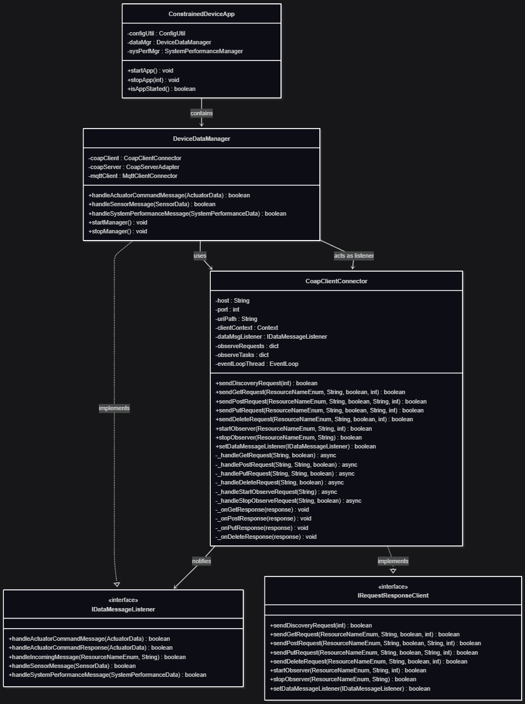

# Constrained Device Application (Connected Devices)

## Lab Module 09

Be sure to implement all the PIOT-CDA-* issues (requirements) listed at [PIOT-INF-09-001 - Lab Module 09](https://github.com/orgs/programming-the-iot/projects/1#column-10488503).

### Description

What does your implementation do? 

A: Implement `CoapClientConnector` with a CoAP server using standard CoAP methods (GET, POST, PUT, DELETE). It supports resource discovery, observation for real-time updates, and handles incoming actuator commands. 

How does your implementation work?

A: Using the `aiocoap` library for asynchronous CoAP operations, running an event loop in a separate thread to handle async requests. The implementation wraps async methods with synchronous interfaces, stores active observations in dictionaries for lifecycle management, and uses a data message listener pattern to notify the application layer when actuator commands are received via GET responses.

### Code Repository and Branch

URL: https://github.com/BenderPL0120/TELE6530_ConstrainedDevice/tree/labmodule09

### UML Design Diagram(s)

### Unit Tests Executed

- 
- 
- 

### Integration Tests Executed

- test_CoapClientConnector
- 
- 

EOF.
