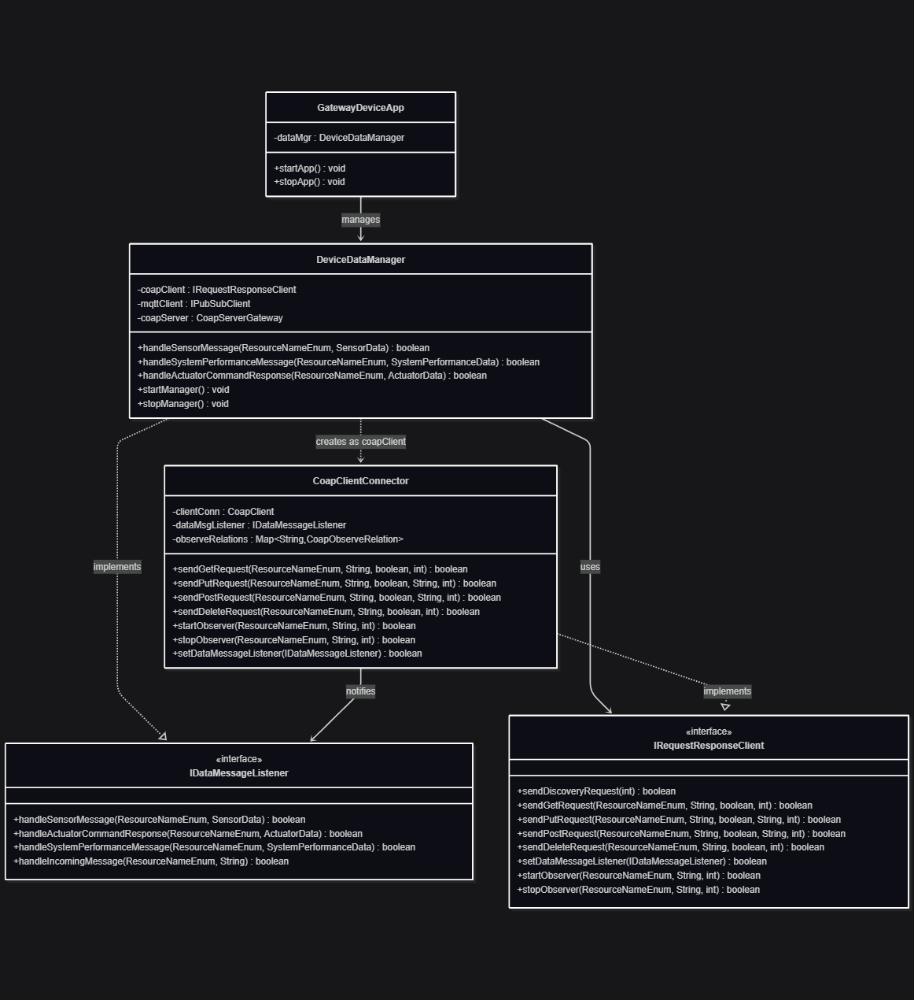

# Constrained Device Application (Connected Devices)

## Lab Module 09

Be sure to implement all the PIOT-CDA-* issues (requirements) listed at [PIOT-INF-09-001 - Lab Module 09](https://github.com/orgs/programming-the-iot/projects/1#column-10488503).

### Description

NOTE: Include two full paragraphs describing your implementation approach by answering the questions listed below.

What does your implementation do? 

A: Implemented a CoAP client-server communication system supports RESTful operations (GET, POST, PUT, DELETE), resource discovery, and real-time data observation for sensor and system performance metrics.

How does your implementation work?

A: 
On client side, `CoapClientConnector` using Eclipse Californium framework to send async requests and manage observe relationships, with specialized handlers (`SensorDataObserverHandler`, `SystemPerformanceDataObserverHandler`) for different data types. 
On server side, created `UpdateSystemPerformanceResourceHandler` as an observable CoAP resource that accepts updates and notifies observers.

### Code Repository and Branch

NOTE: Be sure to include the branch (e.g. https://github.com/programming-the-iot/python-components/tree/alpha001).

URL: https://github.com/BenderPL0120/TELE6530_GatewayDevice/tree/labmodule09

### UML Design Diagram(s)

### Unit Tests Executed

- 
- 
- 

### Integration Tests Executed

- CoapClientConnectorTest
- 
- 

EOF.
