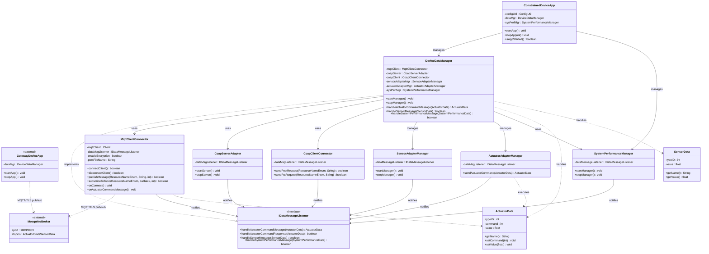

```mermaid
classDiagram
    %% External Systems
    class MosquittoBroker {
        <<external>>
        +port : 1883/8883
        +topics : ActuatorCmd/SensorData
    }

    class GatewayDeviceApp {
        <<external>>
        -dataMgr : DeviceDataManager
        +startApp() void
        +stopApp() void
    }

    %% Application Core
    class ConstrainedDeviceApp {
        -configUtil : ConfigUtil
        -dataMgr : DeviceDataManager
        -sysPerfMgr : SystemPerformanceManager
        +startApp() void
        +stopApp(int) void
        +isAppStarted() boolean
    }

    %% Data Management Layer
    class DeviceDataManager {
        -mqttClient : MqttClientConnector
        -coapServer : CoapServerAdapter
        -coapClient : CoapClientConnector
        -sensorAdapterMgr : SensorAdapterManager
        -actuatorAdapterMgr : ActuatorAdapterManager
        -sysPerfMgr : SystemPerformanceManager
        +startManager() void
        +stopManager() void
        +handleActuatorCommandMessage(ActuatorData) ActuatorData
        +handleSensorMessage(SensorData) boolean
        +handleSystemPerformanceMessage(SystemPerformanceData) boolean
    }

    %% Communication Layer
    class MqttClientConnector {
        -mqttClient : Client
        -dataMsgListener : IDataMessageListener
        -enableEncryption : boolean
        -pemFileName : String
        +connectClient() boolean
        +disconnectClient() boolean
        +publishMessage(ResourceNameEnum, String, int) boolean
        +subscribeToTopic(ResourceNameEnum, callback, int) boolean
        +onConnect() void
        +onActuatorCommandMessage() void
    }

    %% Interface
    class IDataMessageListener {
        <<interface>>
        +handleActuatorCommandMessage(ActuatorData) ActuatorData
        +handleActuatorCommandResponse(ActuatorData) boolean
        +handleSensorMessage(SensorData) boolean
        +handleSystemPerformanceMessage(SystemPerformanceData) boolean
    }

    %% System Components
    class SystemPerformanceManager {
        -dataMessageListener : IDataMessageListener
        +startManager() void
        +stopManager() void
    }

    class SensorAdapterManager {
        -dataMessageListener : IDataMessageListener
        +startManager() void
        +stopManager() void
    }

    class ActuatorAdapterManager {
        -dataMsgListener : IDataMessageListener
        +sendActuatorCommand(ActuatorData) ActuatorData
    }

    class CoapServerAdapter {
        -dataMsgListener : IDataMessageListener
        +startServer() void
        +stopServer() void
    }

    class CoapClientConnector {
        -dataMsgListener : IDataMessageListener
        +sendPostRequest(ResourceNameEnum, String) boolean
        +sendPutRequest(ResourceNameEnum, String) boolean
    }

    %% Data Models
    class ActuatorData {
        -typeID : int
        -command : int
        -value : float
        +getName() String
        +setCommand(int) void
        +setValue(float) void
    }

    class SensorData {
        -typeID : int
        -value : float
        +getName() String
        +getValue() float
    }

    %% System-level connections
    GatewayDeviceApp ..> MosquittoBroker : MQTT/TLS pub/sub
    MqttClientConnector ..> MosquittoBroker : MQTT/TLS pub/sub

    %% Internal relationships
    ConstrainedDeviceApp --> DeviceDataManager : manages
    ConstrainedDeviceApp --> SystemPerformanceManager : manages
    
    DeviceDataManager ..|> IDataMessageListener : implements
    DeviceDataManager --> MqttClientConnector : uses
    DeviceDataManager --> CoapServerAdapter : uses
    DeviceDataManager --> CoapClientConnector : uses
    DeviceDataManager --> SensorAdapterManager : manages
    DeviceDataManager --> ActuatorAdapterManager : manages
    DeviceDataManager --> SystemPerformanceManager : uses
    
    MqttClientConnector --> IDataMessageListener : notifies
    CoapServerAdapter --> IDataMessageListener : notifies
    CoapClientConnector --> IDataMessageListener : notifies
    SensorAdapterManager --> IDataMessageListener : notifies
    SystemPerformanceManager --> IDataMessageListener : notifies
    ActuatorAdapterManager --> IDataMessageListener : notifies
    
    MqttClientConnector ..> ActuatorData : processes
    DeviceDataManager ..> ActuatorData : handles
    DeviceDataManager ..> SensorData : handles
    ActuatorAdapterManager ..> ActuatorData : executes
```