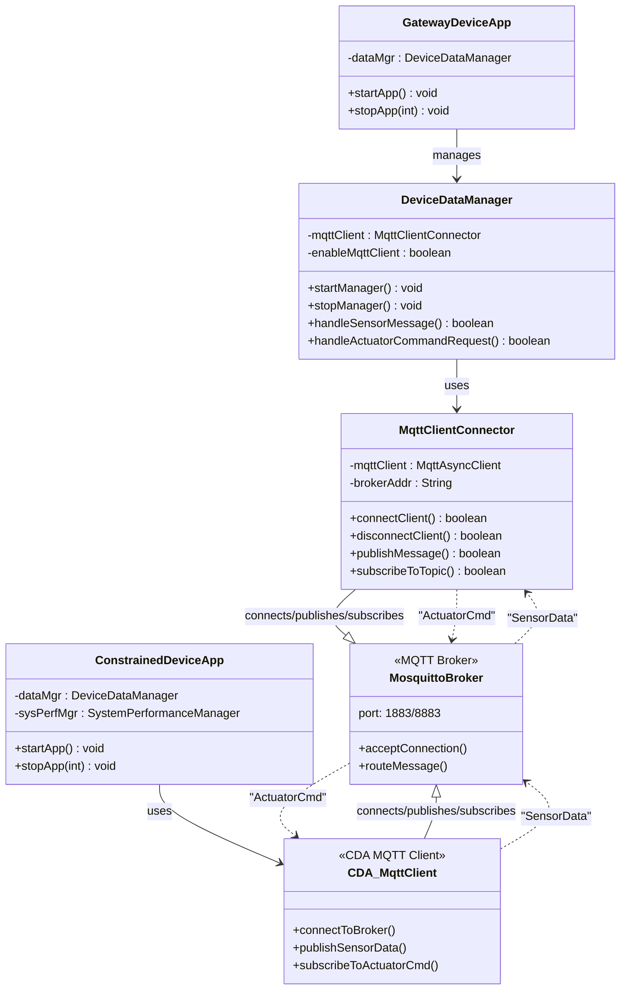

```mermaid
classDiagram
    %% Application Core
    class GatewayDeviceApp {
        -dataMgr : DeviceDataManager
        +startApp() void
        +stopApp(int) void
    }
    
    class DeviceDataManager {
        -mqttClient : MqttClientConnector
        -enableMqttClient : boolean
        +startManager() void
        +stopManager() void
        +handleSensorMessage() boolean
        +handleActuatorCommandRequest() boolean
    }
    
    class MqttClientConnector {
        -mqttClient : MqttAsyncClient
        -brokerAddr : String
        +connectClient() boolean
        +disconnectClient() boolean
        +publishMessage() boolean
        +subscribeToTopic() boolean
    }
    
    %% MQTT Broker
    class MosquittoBroker {
        <<MQTT Broker>>
        port: 1883/8883
        +acceptConnection()
        +routeMessage()
    }
    
    %% CDA Side
    class ConstrainedDeviceApp {
        -dataMgr : DeviceDataManager
        -sysPerfMgr : SystemPerformanceManager
        +startApp() void
        +stopApp(int) void
    }
    
    class CDA_MqttClient {
        <<CDA MQTT Client>>
        +connectToBroker()
        +publishSensorData()
        +subscribeToActuatorCmd()
    }
    
    %% Relationships
    GatewayDeviceApp --> DeviceDataManager : manages
    DeviceDataManager --> MqttClientConnector : uses
    MqttClientConnector --|> MosquittoBroker : connects/publishes/subscribes
    
    ConstrainedDeviceApp --> CDA_MqttClient : uses
    CDA_MqttClient --|> MosquittoBroker : connects/publishes/subscribes
    
    %% Data Flow
    MqttClientConnector ..> MosquittoBroker : "ActuatorCmd"
    MosquittoBroker ..> CDA_MqttClient : "ActuatorCmd"
    CDA_MqttClient ..> MosquittoBroker : "SensorData"
    MosquittoBroker ..> MqttClientConnector : "SensorData"
```