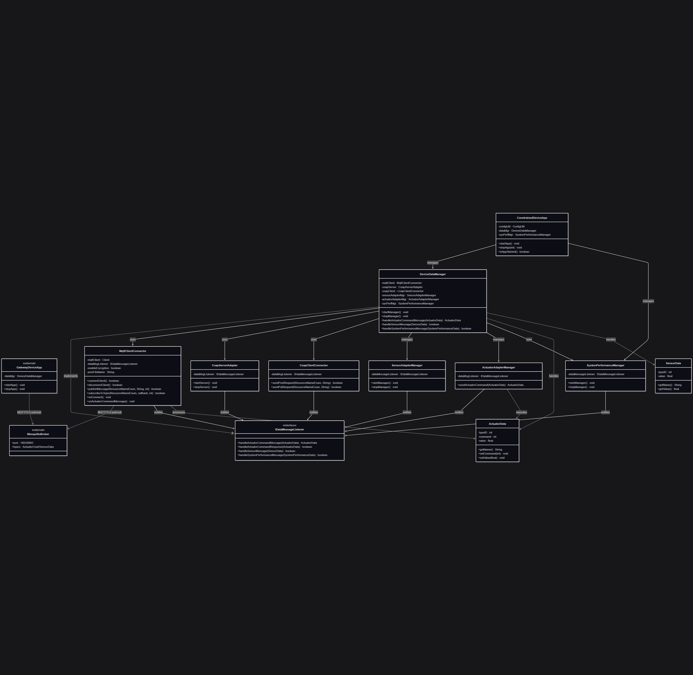

# Constrained Device Application (Connected Devices)

## Lab Module 10

Be sure to implement all the PIOT-CDA-* issues (requirements) listed at [PIOT-INF-10-001 - Lab Module 10](https://github.com/orgs/programming-the-iot/projects/1#column-10488510).

### Description

NOTE: Include two full paragraphs describing your implementation approach by answering the questions listed below.

What does your implementation do? 

A: Implemented MQTT client encrypted connection support, ActuatorData command handling pipeline, and automatic subscription to actuator command topics from GDA

How does your implementation work?

A: Implemented secure MQTT communication with TLS encryption and established an automated ActuatorData command processing pipeline that subscribes to GDA commands on connection, routes them through `DeviceDataManager` to `ActuatorAdapterManager` for execution.

### Code Repository and Branch

URL: https://github.com/BenderPL0120/TELE6530_ConstrainedDevice/tree/labmodule10

### UML Design Diagram(s)

### Unit Tests Executed

- 
- 
- 

### Integration Tests Executed

- test_CoapClientConnector
- test_MqttClientConnector
- test_MqttClientPerformance
- test_CoapClientPerformance

EOF.
