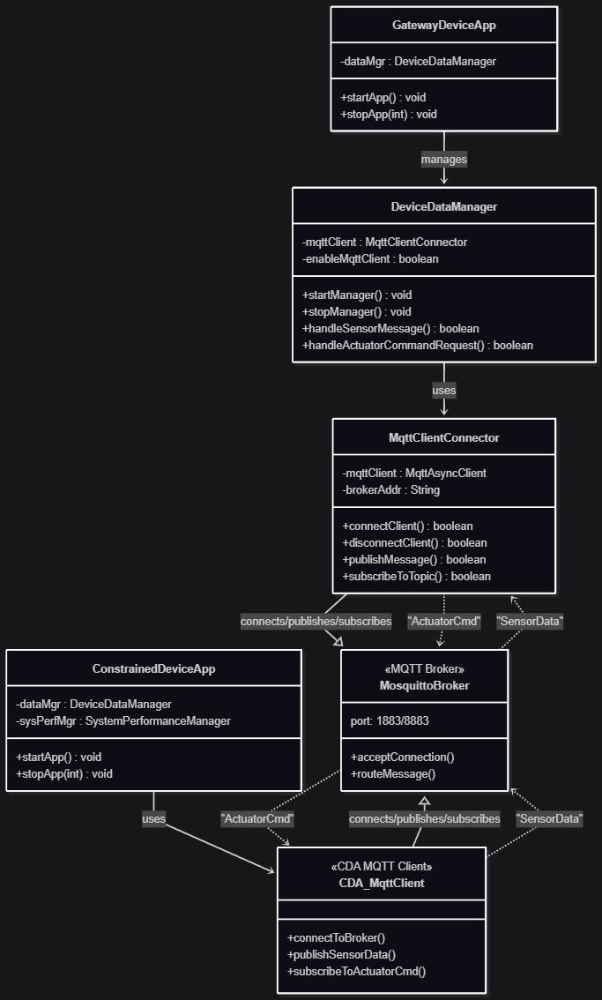

# Gateway Device Application (Connected Devices)

## Lab Module 10

Be sure to implement all the PIOT-GDA-* issues (requirements) listed at [PIOT-INF-10-001 - Lab Module 10](https://github.com/orgs/programming-the-iot/projects/1#column-10488510).

### Description

NOTE: Include two full paragraphs describing your implementation approach by answering the questions listed below.

What does your implementation do? 

A: The `MqttClientConnector` now provides secure MQTT communication with TLS support and message routing to dedicated handlers, while the `DeviceDataManager` analyzes incoming sensor data to automatically trigger threshold-based actuator commands for environmental control.

How does your implementation work?

A: Security is achieved through TLS configuration and credential file authentication with automatic protocol/port switching, while message handling uses type-specific inner listener classes that deserialize JSON and route to callbacks. Sensor analysis employs time-delayed threshold checking per sensor type to prevent rapid actuator switching, triggering appropriate commands when limits are exceeded.

### Code Repository and Branch

URL: https://github.com/BenderPL0120/TELE6530_GatewayDevice/tree/labmodule10

### UML Design Diagram(s)

### Unit Tests Executed

NOTE: TA's will execute your unit tests. You only need to list each test case below
(e.g. ConfigUtilTest, DataUtilTest, etc). Be sure to include all previous tests, too,
since you need to ensure you haven't introduced regressions.

- 
- 
- 

### Integration Tests Executed

NOTE: TA's will execute most of your integration tests using their own environment, with
some exceptions (such as your cloud connectivity tests). In such cases, they'll review
your code to ensure it's correct. As for the tests you execute, you only need to list each
test case below (e.g. SensorSimAdapterManagerTest, DeviceDataManagerTest, etc.)

- CoapClientConnectorTest
- MqttClientConnectorTest
- CoapClientPerformanceTest
- MqttClientPerformanceTest

EOF.
