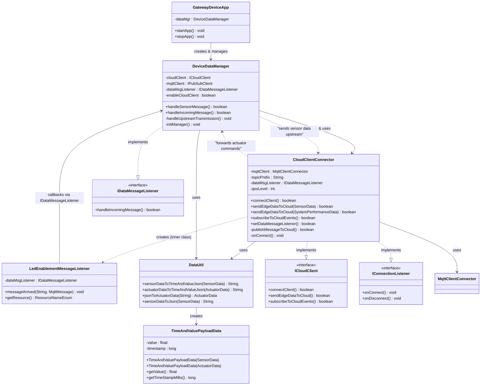

```mermaid
classDiagram
    %% Application Core (simplified)
    class GatewayDeviceApp {
        -dataMgr : DeviceDataManager
        +startApp() void
        +stopApp() void
    }
    
    class DeviceDataManager {
        -cloudClient : ICloudClient
        -mqttClient : IPubSubClient
        -dataMsgListener : IDataMessageListener
        -enableCloudClient : boolean
        +handleSensorMessage() boolean
        +handleIncomingMessage() boolean
        -handleUpstreamTransmission() void
        -initManager() void
    }

    %% Cloud Connectivity
    class CloudClientConnector {
        -mqttClient : MqttClientConnector
        -topicPrefix : String
        -dataMsgListener : IDataMessageListener
        -qosLevel : int
        +connectClient() boolean
        +sendEdgeDataToCloud(SensorData) boolean
        +sendEdgeDataToCloud(SystemPerformanceData) boolean
        +subscribeToCloudEvents() boolean
        +setDataMessageListener() boolean
        -publishMessageToCloud() boolean
        -onConnect() void
    }

    class LedEnablementMessageListener {
        -dataMsgListener : IDataMessageListener
        +messageArrived(String, MqttMessage) void
        +getResource() ResourceNameEnum
    }

    %% Data Models
    class TimeAndValuePayloadData {
        -value : float
        -timestamp : long
        +TimeAndValuePayloadData(SensorData)
        +TimeAndValuePayloadData(ActuatorData)
        +getValue() float
        +getTimeStampMillis() long
    }

    class DataUtil {
        +sensorDataToTimeAndValueJson(SensorData) String
        +actuatorDataToTimeAndValueJson(ActuatorData) String
        +jsonToActuatorData(String) ActuatorData
        +sensorDataToJson(SensorData) String
    }

    %% Interfaces
    class ICloudClient {
        <<interface>>
        +connectClient() boolean
        +sendEdgeDataToCloud() boolean
        +subscribeToCloudEvents() boolean
    }

    class IConnectionListener {
        <<interface>>
        +onConnect() void
        +onDisconnect() void
    }

    class IDataMessageListener {
        <<interface>>
        +handleIncomingMessage() boolean
    }

    %% Relationships
    GatewayDeviceApp --> DeviceDataManager : creates & manages
    DeviceDataManager --> CloudClientConnector : creates & uses
    DeviceDataManager ..|> IDataMessageListener : implements
    CloudClientConnector ..|> ICloudClient : implements
    CloudClientConnector ..|> IConnectionListener : implements
    CloudClientConnector --> MqttClientConnector : uses
    CloudClientConnector ..> LedEnablementMessageListener : creates (inner class)
    CloudClientConnector --> DataUtil : uses
    DataUtil --> TimeAndValuePayloadData : creates
    LedEnablementMessageListener --> DeviceDataManager : callbacks via IDataMessageListener
    DeviceDataManager --> DataUtil : uses
    
    %% Data flow annotations
    DeviceDataManager ..> CloudClientConnector : "sends sensor data upstream"
    CloudClientConnector ..> DeviceDataManager : "forwards actuator commands"
```