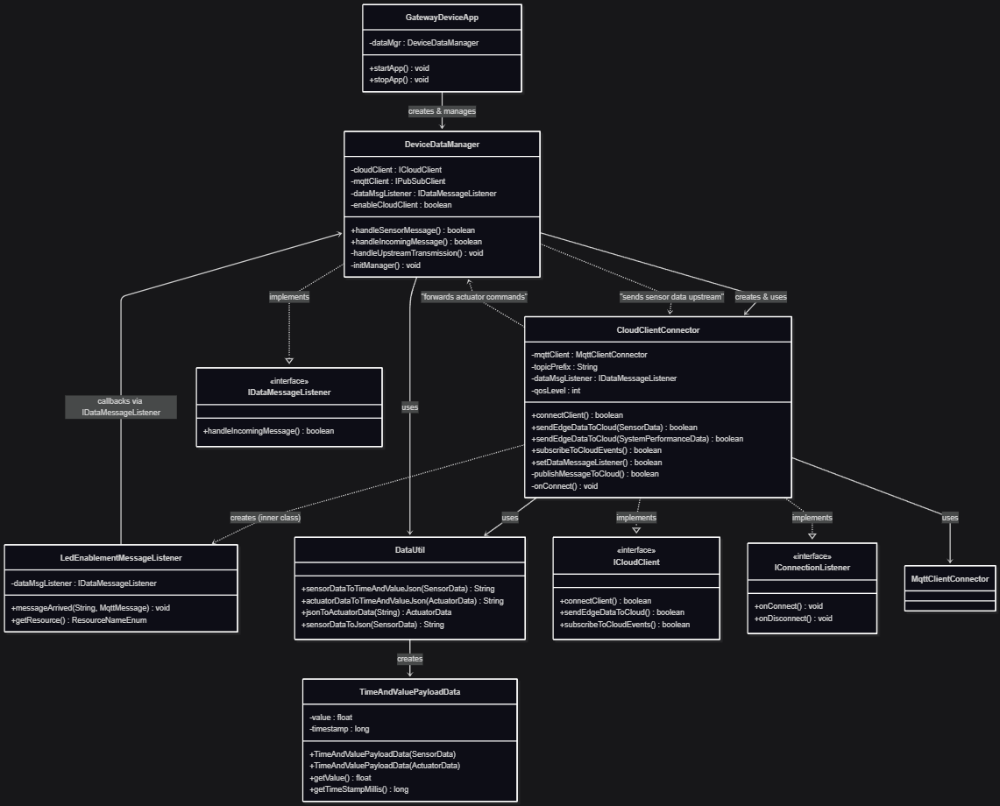

# Gateway Device Application (Connected Devices)

## Lab Module 11

Be sure to implement all the PIOT-GDA-* issues (requirements) listed at [PIOT-INF-11-001 - Lab Module 11](https://github.com/orgs/programming-the-iot/projects/1#column-10488514).

### Description

NOTE: Include two full paragraphs describing your implementation approach by answering the questions listed below.

What does your implementation do? 

A: `TimeAndValuePayloadData` class was created to format payloads with only timestamp and value fields for cloud service compatibility. The `CloudClientConnector` implements bidirectional cloud communication between Cloud and GDA. 

How does your implementation work?

A: The system converts IoT data objects (`SensorData/ActuatorData`) into simplified JSON payloads containing only timestamp-value pairs, and includes a dedicated `IMqttMessageListener` inner class to handle incoming LED actuator commands from the cloud.

### Code Repository and Branch

URL: https://github.com/BenderPL0120/TELE6530_GatewayDevice/tree/labmodule11

### UML Design Diagram(s)

### Unit Tests Executed

- TimeAndValuePayloadDataTest 
- 
- 

### Integration Tests Executed

- CloudClientConnectorTest
- 
- 

EOF.
