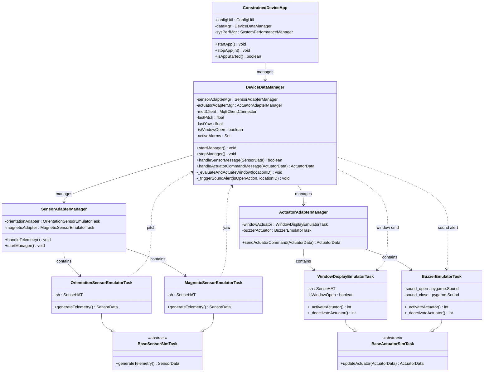

```mermaid
classDiagram
    direction TB

    %% Application Core
    class ConstrainedDeviceApp {
        -configUtil : ConfigUtil
        -dataMgr : DeviceDataManager
        -sysPerfMgr : SystemPerformanceManager
        +startApp() void
        +stopApp(int) void
        +isAppStarted() boolean
    }

    %% Data Management Layer
    class DeviceDataManager {
        -sensorAdapterMgr : SensorAdapterManager
        -actuatorAdapterMgr : ActuatorAdapterManager
        -mqttClient : MqttClientConnector
        -lastPitch : float
        -lastYaw : float
        -isWindowOpen : boolean
        -activeAlarms : Set
        +startManager() void
        +stopManager() void
        +handleSensorMessage(SensorData) boolean
        +handleActuatorCommandMessage(ActuatorData) ActuatorData
        -_evaluateAndActuateWindow(locationID) void
        -_triggerSoundAlert(isOpenAction, locationID) void
    }

    %% Adapter Managers
    class SensorAdapterManager {
        -orientationAdapter : OrientationSensorEmulatorTask
        -magneticAdapter : MagneticSensorEmulatorTask
        +handleTelemetry() void
        +startManager() void
    }

    class ActuatorAdapterManager {
        -windowActuator : WindowDisplayEmulatorTask
        -buzzerActuator : BuzzerEmulatorTask
        +sendActuatorCommand(ActuatorData) ActuatorData
    }

    %% New Sensors
    class OrientationSensorEmulatorTask {
        -sh : SenseHAT
        +generateTelemetry() SensorData
    }

    class MagneticSensorEmulatorTask {
        -sh : SenseHAT
        +generateTelemetry() SensorData
    }

    %% New Actuators
    class WindowDisplayEmulatorTask {
        -sh : SenseHAT
        -isWindowOpen : boolean
        +_activateActuator() int
        +_deactivateActuator() int
    }

    class BuzzerEmulatorTask {
        -sound_open : pygame.Sound
        -sound_close : pygame.Sound
        +_activateActuator() int
        +_deactivateActuator() int
    }

    %% Base Classes
    class BaseSensorSimTask {
        <<abstract>>
        +generateTelemetry() SensorData
    }

    class BaseActuatorSimTask {
        <<abstract>>
        +updateActuator(ActuatorData) ActuatorData
    }

    %% Relationships - Hierarchy
    ConstrainedDeviceApp --> DeviceDataManager : manages
    DeviceDataManager --> SensorAdapterManager : manages
    DeviceDataManager --> ActuatorAdapterManager : manages

    SensorAdapterManager --> OrientationSensorEmulatorTask : contains
    SensorAdapterManager --> MagneticSensorEmulatorTask : contains

    ActuatorAdapterManager --> WindowDisplayEmulatorTask : contains
    ActuatorAdapterManager --> BuzzerEmulatorTask : contains

    %% Inheritance
    OrientationSensorEmulatorTask --|> BaseSensorSimTask
    MagneticSensorEmulatorTask --|> BaseSensorSimTask
    WindowDisplayEmulatorTask --|> BaseActuatorSimTask
    BuzzerEmulatorTask --|> BaseActuatorSimTask

    %% Data Flow
    OrientationSensorEmulatorTask ..> DeviceDataManager : pitch
    MagneticSensorEmulatorTask ..> DeviceDataManager : yaw
    DeviceDataManager ..> WindowDisplayEmulatorTask : window cmd
    DeviceDataManager ..> BuzzerEmulatorTask : sound alert
```