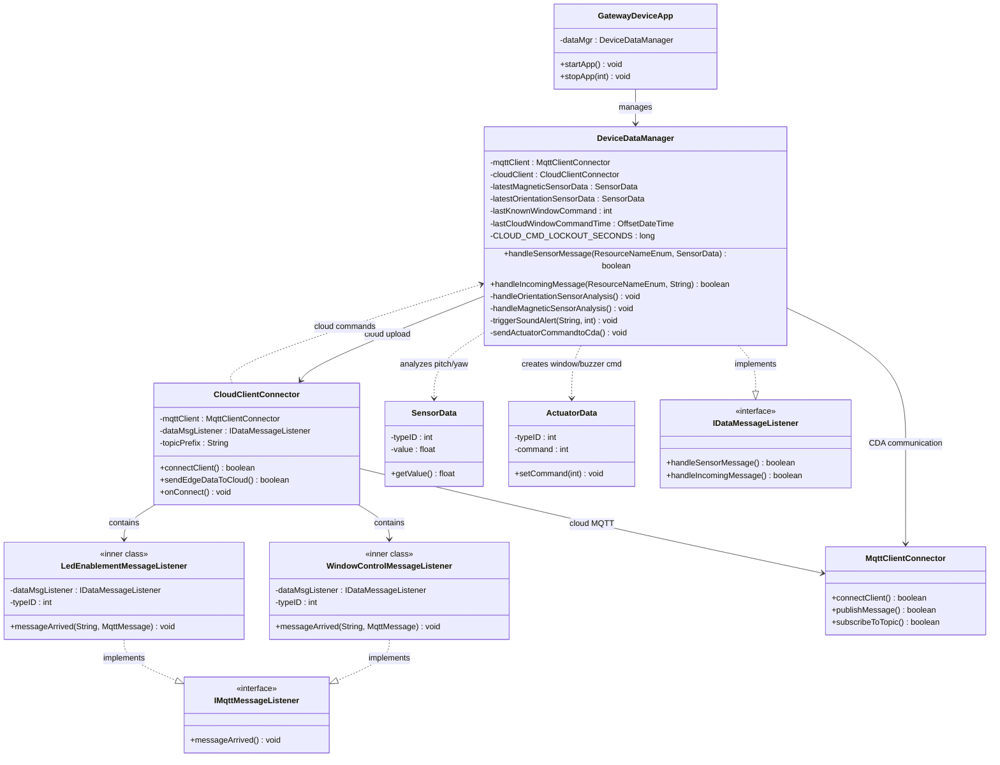

```mermaid
classDiagram
    direction TB

    %% Application Entry Point
    class GatewayDeviceApp {
        -dataMgr : DeviceDataManager
        +startApp() void
        +stopApp(int) void
    }

    %% Core Data Manager
    class DeviceDataManager {
        -mqttClient : MqttClientConnector
        -cloudClient : CloudClientConnector
        -latestMagneticSensorData : SensorData
        -latestOrientationSensorData : SensorData
        -lastKnownWindowCommand : int
        -lastCloudWindowCommandTime : OffsetDateTime
        -CLOUD_CMD_LOCKOUT_SECONDS : long
        +handleSensorMessage(ResourceNameEnum, SensorData) boolean
        +handleIncomingMessage(ResourceNameEnum, String) boolean
        -handleOrientationSensorAnalysis() void
        -handleMagneticSensorAnalysis() void
        -triggerSoundAlert(String, int) void
        -sendActuatorCommandtoCda() void
    }

    %% Cloud Connection
    class CloudClientConnector {
        -mqttClient : MqttClientConnector
        -dataMsgListener : IDataMessageListener
        -topicPrefix : String
        +connectClient() boolean
        +sendEdgeDataToCloud() boolean
        +onConnect() void
    }

    %% Cloud Message Listeners
    class WindowControlMessageListener {
        <<inner class>>
        -dataMsgListener : IDataMessageListener
        -typeID : int
        +messageArrived(String, MqttMessage) void
    }

    class LedEnablementMessageListener {
        <<inner class>>
        -dataMsgListener : IDataMessageListener
        -typeID : int
        +messageArrived(String, MqttMessage) void
    }

    %% MQTT Client
    class MqttClientConnector {
        +connectClient() boolean
        +publishMessage() boolean
        +subscribeToTopic() boolean
    }

    %% Data Classes
    class SensorData {
        -typeID : int
        -value : float
        +getValue() float
    }

    class ActuatorData {
        -typeID : int
        -command : int
        +setCommand(int) void
    }

    %% Interfaces
    class IDataMessageListener {
        <<interface>>
        +handleSensorMessage() boolean
        +handleIncomingMessage() boolean
    }

    class IMqttMessageListener {
        <<interface>>
        +messageArrived() void
    }

    %% Relationships - Hierarchy
    GatewayDeviceApp --> DeviceDataManager : manages
    DeviceDataManager --> CloudClientConnector : cloud upload
    DeviceDataManager --> MqttClientConnector : CDA communication
    DeviceDataManager ..|> IDataMessageListener : implements

    CloudClientConnector --> MqttClientConnector : cloud MQTT
    CloudClientConnector --> WindowControlMessageListener : contains
    CloudClientConnector --> LedEnablementMessageListener : contains

    WindowControlMessageListener ..|> IMqttMessageListener : implements
    LedEnablementMessageListener ..|> IMqttMessageListener : implements

    %% Data Flow
    CloudClientConnector ..> DeviceDataManager : cloud commands
    DeviceDataManager ..> ActuatorData : creates window/buzzer cmd
    DeviceDataManager ..> SensorData : analyzes pitch/yaw
```