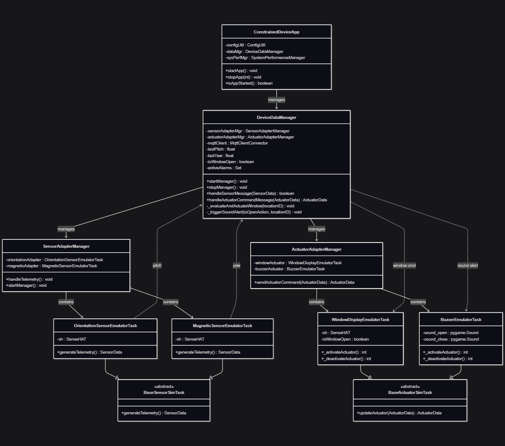

# Constrained Device Application (Connected Devices)

## Lab Module 12 - Semester Project - CDA Components

Be sure to implement all the PIOT-CDA-* issues (requirements) listed at [PIOT-INF-12-001 - Lab Module 12](https://github.com/orgs/programming-the-iot/projects/1#column-10488565).

### Description

NOTE: Include two full paragraphs describing your implementation approach by answering the questions listed below.

What does your implementation do? 

A: Added a smart window control system with environmental safety features:

`Orientation sensor`: Reads pitch angle to detect user intent (tilt device to open/close window)

`Magnetic sensor`: Reads yaw/heading to detect wind direction as a safety constraint

`Window Display actuator`: Shows window state on LED matrix (green vertical line = open, red diagonal = closed)

`Buzzer actuator`: Plays distinct sounds for window open/close events (Zelda sound effects)

The system allows pitch-based window control but automatically forces the window closed when cold/direct wind is detected (yaw between -50° and 50°).

How does your implementation work?

A: 
Sensors use SenseHAT's IMU: `OrientationSensorEmulatorTask` calculates pitch from accelerometer data; 
`MagneticSensorEmulatorTask` reads compass/yaw with calibration offset

`DeviceDataManager` maintains lastPitch and lastYaw state variables, and _evaluateAndActuateWindow() implements a two-layer decision logic:
  Layer 1: If yaw indicates direct wind → force CLOSE (safety override)
  Layer 2: Otherwise, pitch > 50° → OPEN, pitch < -10° → CLOSE (with hysteresis)

`WindowDisplayEmulatorTask` draws patterns on the 8×8 LED matrix using `pisense.array()`

`BuzzerEmulatorTask` uses `pygame.mixer` to play WAV files on activation/deactivation

State changes trigger both the LED display update and sound playback via `_triggerSoundAlert()`

### Code Repository and Branch

URL: https://github.com/BenderPL0120/TELE6530_ConstrainedDevice/tree/labmodule12

### UML Design Diagram(s)

### Unit Tests Executed

- 
- 
- 

### Integration Tests Executed

- test_BuzzerEmulatorTask
- test_MagneticSensorEmulatorTask
- test_OrientationSensorEmulatorTask

EOF.
