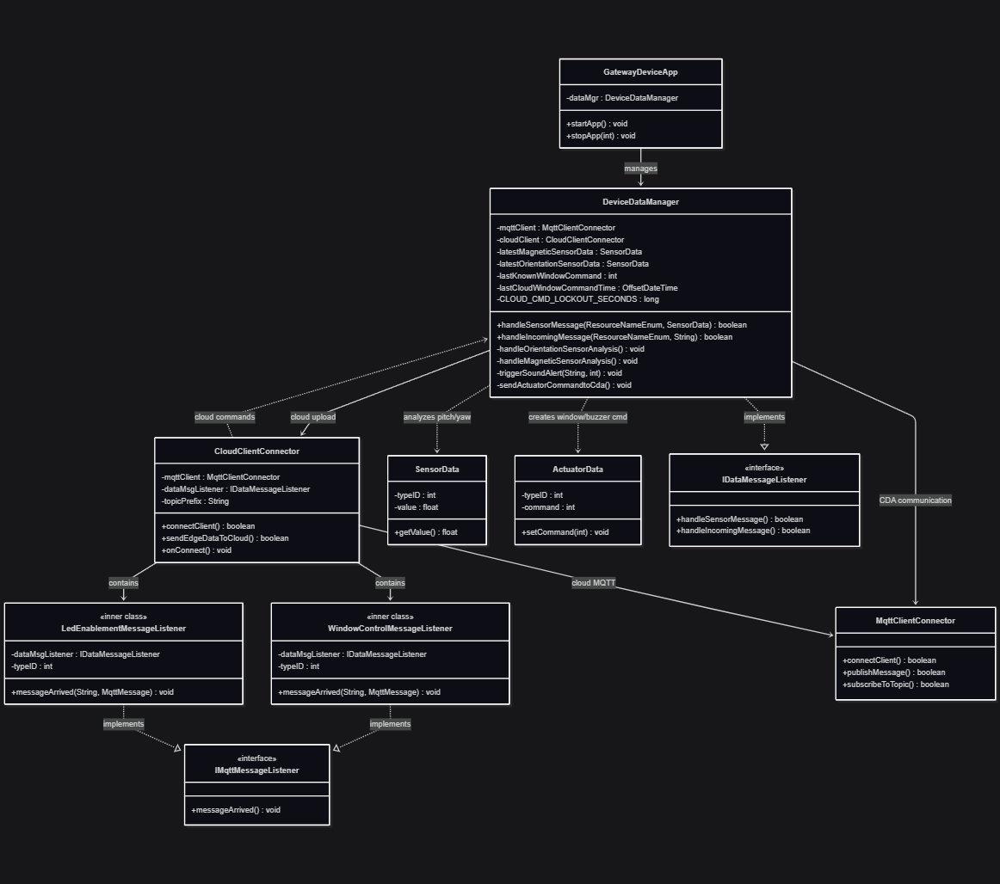

# Gateway Device Application (Connected Devices)

## Lab Module 12 - Semester Project - GDA Components

Be sure to implement all the PIOT-GDA-* issues (requirements) listed at [PIOT-INF-12-001 - Lab Module 12](https://github.com/orgs/programming-the-iot/projects/1#column-10488565).

### Description

NOTE: Include two full paragraphs describing your implementation approach by answering the questions listed below.

What does your implementation do? 

A: The GDA was extended to support smart window control with cloud integration and safety override:

`Orientation/Magnetic sensor analysis`: GDA now processes pitch (user intent) and yaw (wind safety) data from CDA to make window control decisions

`Cloud command integration`: Added cloud-to-edge window control via Ubidots, allowing remote open/close commands

`Multi-layer priority system`: Cloud commands take precedence over local sensor control, with a 120-second lockout period

`Safety validation`: GDA blocks cloud "OPEN" commands if local yaw data indicates unsafe wind conditions

`Buzzer synchronization`: GDA triggers sound alerts on CDA whenever window state changes

How does your implementation work?

A: For `DeviceDataManager`:

Added `handleOrientationSensorAnalysis()`: Evaluates pitch data → triggers window OPEN (pitch > 50°) or CLOSE (pitch < -10°) with time-based threshold

Added `handleMagneticSensorAnalysis()`: Safety lock → forces window CLOSE when yaw is between -50° and 50° (direct wind)

Added `triggerSoundAlert(locationID, command)`: Sends BUZZER_ACTUATOR_TYPE command to CDA via MQTT, synchronized with window actions

Added cloud lockout logic: `lastCloudWindowCommandTime + CLOUD_CMD_LOCKOUT_SECONDS` (120s) prevents local control from overriding recent cloud commands

Added safety check in `handleIncomingMessage()`: Validates yaw before allowing cloud OPEN commands; rejects if unsafe wind detected

For `CloudClientConnector`:

Added `WindowControlMessageListener` inner class

Subscribes to cloud window topic in `onConnect()`

### Code Repository and Branch

URL: https://github.com/BenderPL0120/TELE6530_GatewayDevice/tree/labmodule12

### UML Design Diagram(s)

### Unit Tests Executed

- 
- 
- 

### Integration Tests Executed

- 
- 
- 

EOF.
