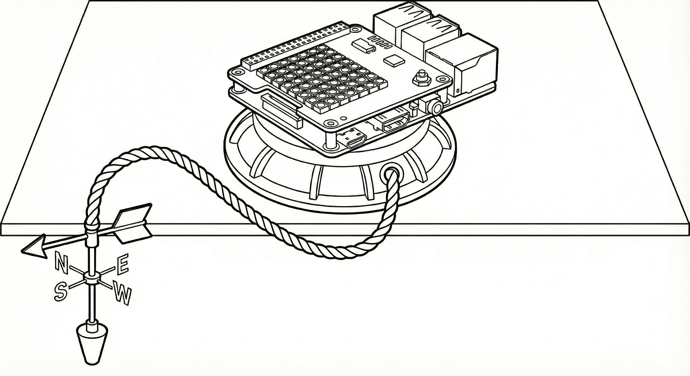
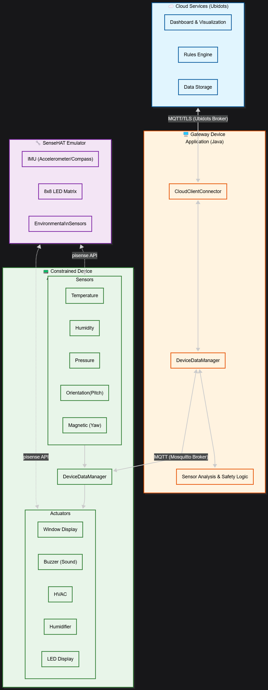

# Lab Module 12 - Semester Project Proposal

## Description

Describe your idea in 1 paragraph (at least 2 or 3 sentences).

A: My concept is to develop a smart window control system that uses magnetic sensors to detect the current wind direction. When wind is detected blowing directly against the window, it automatically closes the window; conversely, it opens the window when wind is detected blowing away from the window.

## What - The Problem 

What problem are you trying to solve and why does it matter? Write 1 to 2 paragraphs in response.

A: Traditional window management requires manual intervention and lacks awareness of environmental conditions, leading to potential issues such as rain damage, energy waste from HVAC systems fighting open windows during extreme weather, or safety hazards when windows are left open during strong winds. This project solves the problem by creating an intelligent window control system that responds to user intent through intuitive gestures (device tilting), automatically enforces safety constraints based on real-time wind detection, and enables remote monitoring and control—ensuring windows are always in the optimal state regardless of whether the user is physically present.

## Why - Who Cares? 

Why do you care about this particular problem? Write 1 to 2 paragraphs in response.

A: I am interested in exploring how multiple data sources (orientation, magnetic/compass, cloud commands) can be fused with proper priority handling to make intelligent decisions at the edge. 

## How - Expected Technical Approach

How do you plan to tackle this problem technically?

Include a high-level design diagram depicting your planned technical approach - it does not need to be final, but it must include the CDA, GDA, and cloud services you plan to use, as well as the protocol(s) you will use for communicating between the devices and the cloud.

Write 1 to 2 paragraphs describing your diagram.

A:

This diagram illustrates a three-tier IoT smart window control system where the `Constrained Device Application (CDA)` collects sensor data from a SenseHAT emulator and controls actuators, communicates with the `Gateway Device Application (GDA)` via MQTT through a local Mosquitto broker, and the GDA performs safety analysis while bridging edge data to Ubidots cloud services using MQTT/TLS for remote monitoring and control.

### What sensors and actuators did you use (add more if you wish)?

- CDA Sensor 1: Orientation

- CDA Sensor 2: Magnetic

- CDA Actuator 1: Window Display

- CDA Actuator 2: Buzzer

## Results - Expected Outcomes 

If your project is successful, what outcome do you expect (e.g. what will happen if everything works)? Write 1 to 2 paragraphs describing your expected outcomes.

A: If the project is successful, the system will enable intelligent automated window control where users can tilt the SenseHAT device (pitch) to open/close a window with audiovisual feedback (LED display + buzzer sounds), while a safety mechanism automatically forces the window closed when direct wind is detected (via magnetic yaw sensor), and remote cloud control through Ubidots dashboard allows users to override local control with appropriate safety validation. The GDA will coordinate all three control sources (local pitch, safety yaw, cloud commands) with proper priority handling, ensuring the window never opens during unsafe wind conditions regardless of the command source.

EOF.
