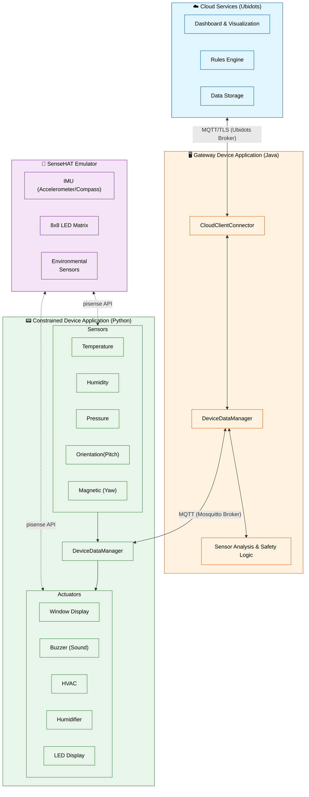

```mermaid
flowchart TB
    subgraph Cloud["☁️ Cloud Services (Ubidots)"]
        Dashboard["Dashboard & Visualization"]
        Rules["Rules Engine"]
        DataStore["Data Storage"]
    end

    subgraph GDA["🖥️ Gateway Device Application (Java)"]
        direction TB
        GDA_DDM["DeviceDataManager"]
        GDA_Cloud["CloudClientConnector"]
        GDA_Analysis["Sensor Analysis & Safety Logic"]
    end

    subgraph CDA["📟 Constrained Device Application (Python)"]
        direction TB
        subgraph Sensors["Sensors"]
            Temp["Temperature"]
            Humidity["Humidity"]
            Pressure["Pressure"]
            Orientation["Orientation(Pitch)"]
            Magnetic["Magnetic (Yaw)"]
        end
        subgraph Actuators["Actuators"]
            Window["Window Display"]
            Buzzer["Buzzer (Sound)"]
            HVAC["HVAC"]
            Humidifier["Humidifier"]
            LED["LED Display"]
        end
        CDA_DDM["DeviceDataManager"]
    end

    subgraph Hardware["🔧 SenseHAT Emulator"]
        IMU["IMU (Accelerometer/Compass)"]
        LEDMatrix["8x8 LED Matrix"]
        EnvSensors["Environmental\nSensors"]
    end

    %% Cloud <-> GDA Communication
    Cloud <-->|"MQTT/TLS (Ubidots Broker)"| GDA_Cloud

    %% GDA <-> CDA Communication
    GDA_DDM <-->|"MQTT (Mosquitto Broker)"| CDA_DDM

    %% Internal GDA flow
    GDA_Cloud <--> GDA_DDM
    GDA_DDM <--> GDA_Analysis

    %% Internal CDA flow
    Sensors --> CDA_DDM
    CDA_DDM --> Actuators

    %% Hardware connections
    Hardware <-.->|"pisense API"| Sensors
    Hardware <-.->|"pisense API"| Actuators

    %% Styling with black text
    classDef cloud fill:#e1f5fe,stroke:#01579b,color:#000000
    classDef gda fill:#fff3e0,stroke:#e65100,color:#000000
    classDef cda fill:#e8f5e9,stroke:#2e7d32,color:#000000
    classDef hardware fill:#f3e5f5,stroke:#7b1fa2,color:#000000

    class Cloud,Dashboard,Rules,DataStore cloud
    class GDA,GDA_DDM,GDA_Cloud,GDA_Analysis gda
    class CDA,Sensors,Actuators,CDA_DDM,Temp,Humidity,Pressure,Orientation,Magnetic,Window,Buzzer,HVAC,Humidifier,LED cda
    class Hardware,IMU,LEDMatrix,EnvSensors hardware
```